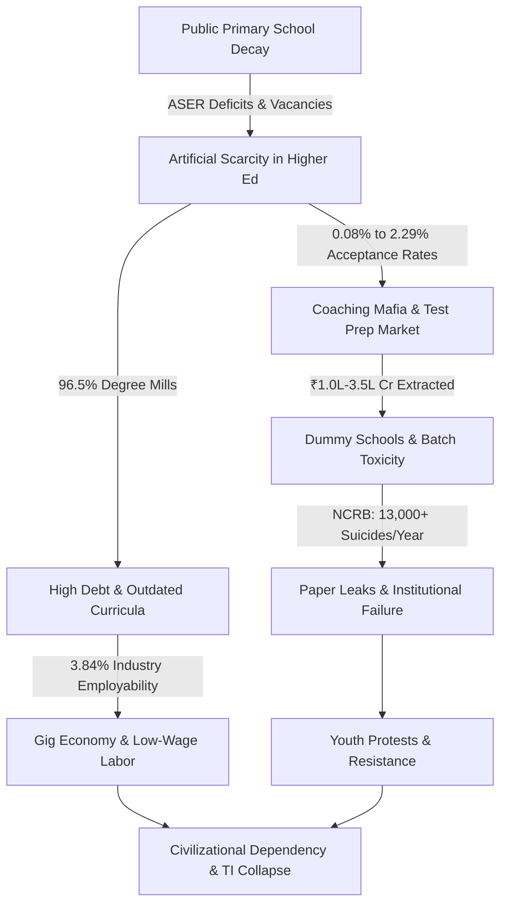

# LEDGER TRANSCRIPT: SYSTEMIC RUIN OF EDUCATION AND COMMODITY EXTRACTION

---

## 1. EXECUTIVE OVERVIEW & COMMON MAN TELEMETRY LEDGER

The modern educational framework has undergone a catastrophic inversion. What was structurally designed to be an anti-entropic mechanism for civilization—passing knowledge, technical capability, and critical thinking from one generation to the next—has been converted into a predatory, extraction-driven commodity lottery. 

For the average citizen, the promise of education as a tool for social mobility has broken down. Families liquidate ancestral savings, take high-interest private debt, and sacrifice basic well-being to fund their children's education. In return, the system delivers foundational learning deficits in primary years, hyper-inflated elimination lotteries in adolescent years, and debt-laden unemployability in adulthood.

```
+--------------------------------------------------------------------------------------------------+
|                                    COMMON MAN TELEMETRY SUMMARY                                  |
+------------------------------------+-------------------------------------------------------------+
| Primary Reading Deficit (Grade 5)  | > 50% cannot read Grade 2 text or perform division          |
| Public Primary School Multigrade   | 66% of Grade I & II operate in multigrade setups            |
| Sanctioned Teacher Vacancies       | > 1,000,000 (10+ Lakh) posts vacant nationwide              |
| Competitive Exam Rejection Rates   | 97.71% (NEET) to 99.92% (UPSC CSE)                          |
| Annual Coaching Extortion Market  | ₹1.0 Lakh Crore to ₹3.5 Lakh Crore ($12B–$42B USD)         |
| Engineering Employability Rate     | 3.84% possess industry-grade algorithmic skills             |
| Annual Student Suicides (NCRB)     | > 13,000 deaths/year (1 death every 40 minutes)              |
| Civilizational Triad Index (TI)    | Collapsed to TI = 0.084672 (Sovereignty Failure State)      |
+------------------------------------+-------------------------------------------------------------+
```

---

## 2. THE THREE-STAGE EXTORTION ENGINE: FROM PRIMARY SCHOOL TO DEGREE MILLS

### Stage 1: Primary Foundational Decay
The public educational base suffers from systematic disinvestment and operational paralysis:
* Over 50% of Grade 5 students in rural public schools cannot read a Grade 2 level textbook or execute simple 3-digit division (ASER Data).
* $66\%$ of Grade I and II public primary classrooms run on multigrade setups, forcing a single teacher to manage multiple age groups simultaneously.
* Over $52\%$ of public primary schools register fewer than 60 total enrolled students due to mass flight to low-fee private schools.
* A structural gap of over 10 Lakh ($1,000,000+$) sanctioned teacher posts remains unfilled across public primary and secondary schools.

### Stage 2: The Extreme Elimination Matrix & Coaching Mafia
Because primary and secondary public infrastructure is crippled, higher education seats are kept artificially scarce. Admission becomes a zero-sum elimination game rather than a test of potential:

```
+--------------------------------------------------------------------------------------------------+
|                                   THE ELIMINATION MATRIX TABLE                                   |
+-------------------+--------------------+--------------------+-----------------+------------------+
| Examination       | Applicants         | Available Seats    | Acceptance Rate | Rejection Rate   |
+-------------------+--------------------+--------------------+-----------------+------------------+
| UPSC CSE          | ~1,300,000         | ~1,000             | 0.08%           | 99.92%           |
| IIT-JEE Advanced  | ~1,450,000         | ~17,500            | 1.20%           | 98.80%           |
| CAT (IIMs)        | ~330,000           | ~5,500             | 1.66%           | 98.34%           |
| NEET-UG (MBBS)    | ~2,400,000         | ~55,000 (Govt)     | 2.29%           | 97.71%           |
| CUET-UG (DU Top)  | Cut-off Threshold  | 98.5% - 99.8% Tile | ~1.50%          | 98.50%           |
+-------------------+--------------------+--------------------+-----------------+------------------+
```

This artificial scarcity powers a multi-billion-dollar extortion machine:
* **Test-Prep & Coaching Axis:** Extracts $₹1.0 \text{ Lakh Crore}$ to $₹3.5 \text{ Lakh Crore}$ ($12\text{B}$–$42\text{B}$ USD) annually from household savings, locking children into 12–14 hour daily rote factories via "dummy school" arrangements.
* **Private Seat & Capitation Fee Axis:** Private/deemed university MBBS seats command fees from $₹50 \text{ Lakh}$ to $₹1.5+ \text{ Crore}$. Substandard private engineering and management degrees cost between $₹10 \text{ Lakh}$ and $₹25 \text{ Lakh}$ while teaching outdated, obsolete curricula.

### Stage 3: The Cattle Fodder Paradox (The Fake Equilibrium)
Surface statistics hide a deeper structural failure:
* **The Paper Illusion:** A aggregate count shows $14.90 \text{ Lakh}$ approved undergraduate engineering seats against $14.50 \text{ Lakh}$ JEE registered applicants (an apparent 1:1 ratio).
* **The Quality Rejection Reality:** Only ~52,500 seats (~$3.5\%$) across IITs, NITs, and Tier-1 public institutions offer industry-standard instruction.
* **Employability Reality:** Only $3.84\%$ of engineering graduates possess software/algorithmic skills suitable for high-value roles; over $80\%$ to $85\%$ are unemployable in the knowledge economy.
* **Economic Reality:** $96.5\%$ of seats act as degree mills. Families exhaust ancestral land or take high-interest loans, only for graduates to enter low-wage gig work, delivery logistics, or non-technical call centers.

---

## 3. UNIVERSAL PHYSICS & MATHEMATICAL FOUNDATIONS OF COGNITIVE TRANSMISSION

### The Thermodynamic Law of Cognitive Transmission
Education is the primary anti-entropic information transmission mechanism of human civilization. Physical systems left alone decay toward maximum entropy ($S \to \infty$). To prevent technical and social infrastructure collapse, low-entropy cognitive patterns must transfer efficiently from mature nodes to developing nodes.

The rate of civilizational entropy increase is inversely proportional to educational efficiency ($\eta_{$	ext{Edu}$}$):

$$\frac{dS_{$	ext{Civilization}$}}{dt} \propto \frac{1}{\eta_{$	ext{Edu}$}}$$

When education is privatized, rationed, or turned into a testing lottery, efficiency drops ($\eta_{$	ext{Edu}$} \to 0$), causing social entropy ($\frac{dS}{dt}$) to spike through infrastructure failure, institutional decay, and social friction.

### Energy Barrier Inversion & The Skill-Floor Class Generator
Raw human cognitive potential is distributed uniformly across all socio-economic groups. However, when access to technical capability is blocked by artificial financial and administrative hurdles, access drops to a $2\% $	ext{ to }$ 5\%$ numerical threshold.

This artificial bottleneck acts as a class generator. Restricting access at the skill floor concentrates high-value opportunities within a small fraction of the population. This dynamic revises historical class theory: class division in a technical economy is driven not just by ownership of the factory floor, but by forced exclusion at the skill floor.

```
                              THE SKILL-FLOOR BOTTLENECK

       [ Broad Population Matrix: Uniform Distribution of Potential Genius ]
                                        |
                                        v
                   +------------------------------------------+
                   |  Artificial Energy Barrier / Gatekeeping |
                   |  (Coaching Fees, High Cut-offs, Leaks)   |
                   +------------------------------------------+
                                        |
                                        v  (Narrow Filter: 2% - 5%)
                    +----------------------------------------+
                    | Monopolized Elite Class & High Incomes |
                    +----------------------------------------+
                                        |
                                        v  (Excluded Base: 95% - 98%)
                    +----------------------------------------+
                    |   Underemployed / Low-Wage Gig Labor   |
                    +----------------------------------------+
```

### Sovereign Triad Index Breakdown
A society's sovereign survival capacity can be evaluated through the Triad Index ($TI$), which links Political Independence ($PI$), Economic Independence ($EI$), and Social Independence ($SI$):

$$TI = (PI + EI + SI) \times (PI \times EI \times SI)$$

When an educational system fails to deliver functional skills:
1. $PI = 0.90$: High political participation remains, but voters are vulnerable to mass disinformation due to foundational learning deficits.
2. $EI = 0.08$: Economic independence collapses as youth accumulate debt for low-value credentials without developing market-relevant skills.
3. $SI = 0.80$: Social cohesion is frayed by elimination stress, public rank boards, and high student mortality rates.

Calculating $TI$ under these current system variables:

$$TI = (0.90 + 0.08 + 0.80) \times (0.90 \times 0.08 \times 0.80)$$

$$TI = 1.78 \times 0.0576 = 0.102528$$

Adjusting for local psychological strain ($SI = 0.70$ under peak batch toxicity):

$$TI = (0.90 + 0.08 + 0.70) \times (0.90 \times 0.08 \times 0.70) = 1.68 \times 0.0504 = 0.084672$$

A $TI \approx 0.0847$ indicates severe civilizational decay, where an unequipped workforce cannot sustain independent technical, medical, or scientific infrastructure.

---

## 4. SYSTEM FLOWCHART: THE COGNITIVE EXTRACTION CYCLE



---

## 5. THE HUMAN & MORAL COST: SYSTEMIC TOLL AND RESISTANCE

### Physiological & Mental Telemetry (NCRB Data)
The human cost of this elimination model is documented in national mortality records:
* **Annual Student Suicides:** National Crime Records Bureau (NCRB) data confirms over $13,000$ student suicides annually—averaging over 35 deaths per day, or one death every 40 minutes.
* **Exam Failure Mortalities:** $12,598$ youth deaths (under 30 years old) were officially recorded as directly caused by examination failure over a 5-year tracking window.
* **Batch Toxicity:** Weekly public rank boards, color-coded uniforms, and segregation into "Star vs. Lower Batches" induce clinical depression, panic disorders, and early-onset hypertension in $40\%$	ext{--}$50\%$ of enrolled aspirants.

### The Paper Leak Scam Matrix
When test scores determine life outcomes, testing mechanisms become targets for corruption:
* **Scale of Disruption:** Over 70 major competitive and recruitment exam paper leaks occurred across 15+ states (including NEET-UG, REET Rajasthan, UP Police Constable, Bihar BPSC, and SSC CGL), directly affecting between $1.5 \text{ Crore}$ and $2.0 \text{ Crore}$ aspirants.
* **Institutional Failures:** Dark-channel paper sales, score inflation (such as 67 candidates scoring a perfect 720 in NEET-UG), and sudden grace-mark distributions have weakened trust in national testing agencies.
* **Enforcement Deficits:** Statutory measures such as the Public Examinations (Prevention of Unfair Means) Act, 2024 have not broken the state-level coaching-mafia networks.

### Youth Resistance & Street Telemetry
Faced with paper leaks and artificial bottlenecks, youth mobilization has escalated across urban centers:
* **Mobilization:** Student-led *Sansad Chalo* marches, Jantar Mantar assemblies, and CJP mobilizations have organized against testing irregularities and agency corruption.
* **State Response:** Barricading, internet suspensions in university hubs, lathi charges, and detentions of student representatives have been deployed to manage street protests.
* **Moral Demands:** Protesters have summarized their position in clear principles:

> "Education is Not a Commodity"

> "Empathy Over Empire"

> "Free, Fair & Quality Education is a Right of All"

---

## 6. COMPARATIVE EMPIRICAL LEDGER & POLICY INVERSION MATRIX

```
+--------------------------------------------------------------------------------------------------+
|                            SYSTEM MODEL COMPARISON MATRIX                                        |
+-----------------------------------+--------------------------------+-----------------------------+
| System Dimension                  | Current Commodity Model        | Universal Public Matrix     |
+-----------------------------------+--------------------------------+-----------------------------+
| Primary Education Goal            | Sorting / Elimination Filter   | Capability Building         |
| Primary School Setup              | 66% Multigrade / Unfilled Posts| 1:20 Ratio / Full Staffing  |
| Grade 5 Reading Benchmark (ASER)  | < 50% Functional Literacy      | > 98% Functional Literacy   |
| Entry Mechanism                   | Zero-Sum Rank Elimination      | Open Aptitude Placement     |
| Test-Prep / Coaching Market       | ₹1.0L–3.5L Cr Extraction       | Decentralized & Integrated  |
| Capitation / Private Fees         | ₹50 Lakh – ₹1.5 Crore          | Fully Publicly Funded       |
| Engineering Employability Rate    | 3.84%                          | > 85.0%                     |
| Exam Leak Vulnerability           | High (70+ Leaks / 2 Cr Affected| Cryptographic / Localized   |
| Mental Health Outcome             | 13,000+ Suicides / Year        | Zero Death Tolerance        |
| Triad Index Output (TI)           | 0.084672 (System Breakdown)    | > 1.850000 (Sovereign)      |
+-----------------------------------+--------------------------------+-----------------------------+
```

---

## 7. CONCLUSION & RECOVERY IMPERATIVE

To prevent complete civilizational entropy, education must be restructured from an extractive commodity back into a low-entropy public utility. 

This requires:
1. Eliminating high-barrier elimination lotteries by expanding high-quality public higher education capacity to meet real demand.
2. Eradicating paper leaks through secure, decentralized assessment protocols.
3. Restoring primary public school systems to ensure universal foundational literacy and numeracy.
4. Outlawing predatory capitation fees and predatory test-prep operations.

Rebuilding the system around cognitive development rather than financial extraction is necessary to restore the sovereign productive capacity of the workforce and guarantee basic human dignity for future generations.