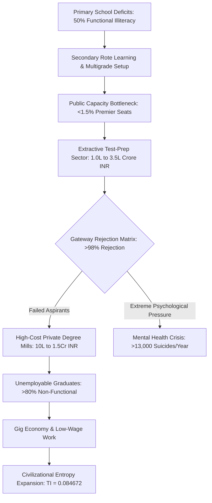
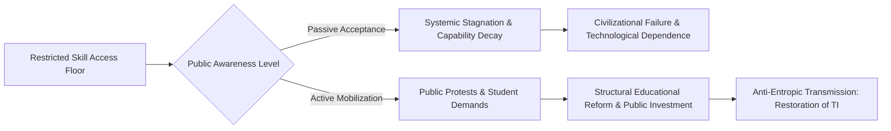

# SYSTEMIC LEDGER: SYSTEMIC RUIN OF EDUCATION AND COMMODITY EXTRACTION

---

## 1. COMPILATION OVERVIEW & SYSTEM TELEMETRY

This ledger provides an empirical and universal physics-based assessment of educational decay, exam corruption, and commodity-based extraction within contemporary education systems. By combining local data with civilizational thermodynamic models, this synthesis maps how converting learning into a profit-driven gatekeeping lottery destabilizes cognitive development, damages social trust, and erodes economic capacity.

```
+-----------------------------------------------------------------------------------+
|                        TELEMETRY RECORD: MATRIX EVALUATION                        |
+------------------------------------+----------------------------------------------+
| SYSTEMIC VECTOR QUERY              | Systemic Ruin of Education & Extraction      |
| TARGET YEAR FRAME                  | 2026 State Variables                         |
| TOTAL INDEPENDENCE (TI) SCORE      | 0.084672 (CRITICAL SYSTEMIC DEGRADATION)     |
| ECONOMIC INDEPENDENCE (EI) SCORE   | 0.080000 (NEAR-TOTAL FUNCTIONAL IMPAIRMENT)  |
| PRIMARY REJECTION AGGREGATE        | >98.0% Across All National Gateway Exams     |
+------------------------------------+----------------------------------------------+
```

---

## 2. LOCAL EMPIRICAL ANALYSIS: THE INDIAN EDUCATION EXHUMATION

### A. Primary & Secondary Foundational Decay
* **Learning Deficits (ASER Telemetry):** Over $50\%$ of Grade 5 students in rural public schools are unable to read a basic Grade 2 textbook or execute simple 3-digit division problems.
* **Multigrade Classrooms & Shrinkage:** $66\%$ of Grade 1 and 2 public primary classrooms operate on multigrade setups where a single instructor manages multiple grade levels simultaneously. Over $52\%$ of public primary schools maintain fewer than $60$ total enrolled students due to mass flight toward low-fee private alternatives.
* **Teacher Vacancies:** Over $1,000,000$ ($10\text{ Lakh}$) sanctioned public teaching positions remain unfilled across primary and secondary schools nationwide.

### B. Public University Bottlenecks & Hyper-Inflation Cut-Offs
* **Central University Gatekeeping (CUET UG):** Qualifying cut-offs for premier public colleges (such as DU North Campus: SRCC, Hindu, Hansraj, St. Stephen's) sit between $98.5\%$ and $99.8\%$ percentile ($780$	ext{--}$795+ / 800$) for general candidates in high-demand disciplines.
* **Capacity Scarcity:** Seats in premier public higher education institutions account for less than $1.5\%$ of the over $40,000,000$ national applicants, creating an artificial shortage of viable academic pathways.

### C. The Extreme Elimination Matrix
The following table outlines the structural rejection dynamics across top national competitive examinations:

| Examination Name | Applicant Pool | Sanctioned / Tier-1 Seats | Rejection Rate |
| :--- | :--- | :--- | :--- |
| **UPSC Civil Services (CSE)** | ~1,300,000 | ~1,000 | **99.92%** |
| **IIT-JEE Advanced** | ~1,450,000 | ~17,500 | **98.80%** |
| **NEET-UG (Medical)** | ~2,400,000 | ~55,000 (Govt MBBS) | **97.71%** (98.15% overall) |
| **CAT (IIM Management)** | ~330,000 | ~5,500 | **98.34%** |

### D. The Triad of Educational Extortion
* **Axis 1 (Test-Prep & Coaching Complex):** Extracts ₹$1.0\text{ Lakh Crore}$ to ₹$3.5\text{ Lakh Crore}$ ($\$12\text{B}$ to $\$42\text{B USD}$) annually from household savings, operating 12-to-14-hour rote learning facilities via "dummy school" arrangements.
* **Axis 2 (Private Seat Capitation):** The full cost of private or deemed university MBBS degrees ranges from ₹$50\text{ Lakh}$ to over ₹$1.5\text{ Crore}$. Private engineering and management degrees range from ₹$10\text{ Lakh}$ to ₹$25\text{ Lakh}$, frequently delivering low-quality instruction and outdated curricula.

### E. Human Cost & Mental Health Metrics
* **Student Suicides (NCRB Data):** National Crime Records Bureau statistics confirm over $13,000$ student suicides annually, exceeding $35$ deaths per day (approximately $1$ death every $40$ minutes).
* **Exam Failure Mortalities:** $12,598$ youth deaths (under $30$ years of age) have been officially recorded as directly caused by examination failure over a five-year tracking window.
* **Institutional Segregation:** Public rank scoreboards, color-coded student uniforms, and "Star versus Lower Batch" physical isolation lead to documented clinical depression, anxiety disorders, and early-onset hypertension in $40\%$ to $50\%$ of enrolled coaching candidates.

### F. Exam Integrity & Paper Leak Mechanics
* **Scale of Disruption:** Over $70$ major competitive and recruitment examination leaks have been recorded across more than $15$ states (including NEET-UG, REET Rajasthan, UP Police Constable, Bihar BPSC, and SSC CGL), affecting between $15,000,000$ and $20,000,000$ aspirants.
* **Institutional Vulnerabilities:** Dark-channel paper sales, inflated top scores (such as $67$ perfect score outcomes of $720/720$ in NEET-UG), and unannounced grace-mark allocations have reduced public trust in national testing agencies.
* **Legislative Deficit:** Statually enacted frameworks, such as the *Public Examinations (Prevention of Unfair Means) Act, 2024*, have not succeeded in dismantling established state-coaching-mafia networks.

### G. The Cattle Fodder Paradox
* **Surface vs. Real Quality Capacity:** While there are $1,490,000$ approved undergraduate engineering seats relative to $1,450,000$ JEE applicants (a surface ratio of roughly $1:1$), only approximately $52,500$ seats ($\approx 3.5\%$) across IITs, NITs, and top-tier institutions provide industry-grade technical education.
* **Employability Reality:** Only $3.84\%$ of engineering graduates display baseline industry-grade software and algorithmic skills. Over $80\%$ to $85\%$ remain unemployable in the modern knowledge economy.
* **Socio-Economic Trap:** $96.5\%$ of degree-granting seats function as low-value credential mills. Families frequently exhaust ancestral savings or incur debt, only for graduates to enter low-wage gig work, delivery roles, or non-technical call centers.

> "A nation is defined exclusively by the cognitive, moral, and productive capacity of its citizens. Converting education into an extortionate lottery systematically sabotages the republic's sovereign future, locking the civilization into technological dependency and structural weakness."

---

## 3. UNIVERSAL PHYSICS MATRIX: THERMODYNAMICS OF COGNITIVE COLLAPSE

### A. Anti-Entropic Information Transmission
In physical systems, entropy ($S$) naturally increases toward maximum disorder ($S \rightarrow \infty$). Education acts as a primary anti-entropic mechanism that transfers structured, low-entropy information patterns from mature nodes to developing nodes.

The rate of civilizational thermodynamic decay is governed by:

$$\frac{dS_{$	ext{Civilization}$}}{dt} \propto \frac{1}{\eta_{$	ext{Edu}$}}$$

Where $\eta_{$	ext{Edu}$}$ represents the efficiency of cognitive transmission. When $\eta_{$	ext{Edu}$}$ approaches zero due to artificial bottlenecks, structural entropy increases rapidly across civilizational infrastructure.

### B. Equal Cognitive Distribution vs. Energy Barriers
Cognitive potential and creative capability are distributed uniformly across a human population. Systemic resilience requires the unimpeded movement of potential from any node to any functional role.

Creating high artificial energy barriers (such as excessive tuition fees, gatekeeping lotteries, and credential paywalls) isolates over $95\%$ of the population matrix. This setup introduces severe structural resistance ($R_{$	ext{sys}$}$), limiting the collective problem-solving output of the society.

### C. Class Generation via Skill Floor Restriction
When access to high-quality training and skill acquisition is capped at a narrow numerical threshold (e.g., $2\%$	ext{--}$5\%$), an elite class is formed within that restricted zone. Restricting the skill floor manufactures an underprivileged, low-wage majority ($95\%$	ext{--}$98\%$), driving high socio-economic inequality.

```
       ARTIFICIAL CAPACITY BOTTLENECK (2% - 5% ADMISSION FLOOR)
                                 |
        +------------------------+------------------------+
        |                                                 |
        v                                                 v
+-----------------------+                         +-----------------------+
|  ELITE CONCENTRATION  |                         | MANUFACTURED MAJORITY |
|  (2% - 5% OF NODES)   |                         |  (95% - 98% OF NODES) |
|  High Capital Capture |                         | Deprived Skill Baseline|
|  Resource Dominance   |                         |  Low Wage Gig Economy |
+-----------------------+                         +-----------------------+
```

### D. Signal-to-Noise Inversion
When education shifts from human capability development to an extractive market asset, its primary operational function changes:

* **Signal Transmission (True Function):** Focuses on core comprehension, physical and mathematical literacy, creative synthesis, and problem-solving.
* **Noise Generation (Distorted Function):** Focuses on rote memorization, high-stakes testing, test-taking tricks, credential accumulation, and high rejection rates.

```
[CIVILIZATIONAL INPUT] ---> [EXTRACTIVE COMMODITY FILTER] ---> [NOISE GENERATION]
                                                               (Rote Tricks, Debt,
                                                                High Rejection Rates)
```

### E. Total Independence (TI) Index Coupling Analysis
A civilization's structural stability is evaluated using the Total Independence ($TI$) formula:

$$TI = (PI + EI + SI) \times (PI \times EI \times SI)$$

Where:
* $PI$ = Political Independence Score
* $EI$ = Economic Independence Score
* $SI$ = Social Independence Score

#### Parameter Input Values
* $PI = 0.90$ (High formal political structures present)
* $EI = 0.08$ (Impaired economic capability due to debt and low employability)
* $SI = 0.70$ (Social cohesion maintained under pressure)

#### Calculation
$$TI = (0.90 + 0.08 + 0.70) \times (0.90 \times 0.08 \times 0.70)$$

$$TI = (1.68) \times (0.0504) = 0.084672$$

The low overall $TI$ score ($0.084672$) demonstrates that economic decay from skill bottlenecks directly degrades total civilizational independence.

### F. Civilizational Phase Transitions & Street Telemetry
Restricting educational access leads to one of two structural outcomes:

1. **Internal Stagnation:** Credential inflation weakens elite performance, while the broader workforce lacks functional technical capability, reducing systemic problem-solving capacity.
2. **Mass Systemic Inversion:** When aspirants recognize the skill floor is structurally restricted, public trust declines, shifting collective efforts toward active systemic reform and street-level protests.

> "Education is Not a Commodity"

> "Empathy Over Empire"

> "Free, Fair & Quality Education is a Right of All"

---

## 4. SYSTEM COMPARISON AND EMPIRICAL DATA MATRIX

| Metric / Dimension | Functional Public Model | Present Extractive Reality | Systemic Impact |
| :--- | :--- | :--- | :--- |
| **Primary Class Objective** | Core Literacy & Problem-Solving | Multigrade Survival ($66\%$) | $>50\%$ Grade 5 Reading Deficit |
| **Gateway Rejection Rate** | Moderate Capability Assessment | Extreme Elimination ($>98\%$) | High Student Stress & Suicides |
| **Coaching Sector Revenue** | Negligible / Supplemental | ₹$1.0\text{L Cr}$ to ₹$3.5\text{L Cr}$ | Massive Household Savings Drain |
| **Graduation Employability** | $>80\%$ Industry Standard | $3.84\%$ High-Skill Baseline | Mass Entry into Low-Wage Gig Work |
| **System Entropy ($S$)** | Low / Anti-Entropic | High / Rapid Decay | Deteriorating Technical Infrastructure |

---

## 5. MERMAID SYSTEM FLOWCHARTS

### System Architecture Flowchart: Extractive Education Pipeline



### Phase Transition Flowchart: Reform vs. Collapse



---

## 6. ACTIONABLE DIAGNOSTIC CONCLUDING DIRECTIVES

1. **Eliminate Multi-Grade Primary Structures:** Reallocate public education funding to fill all $1,000,000+$ vacant teacher positions and guarantee single-grade instructional settings.
2. **Expand Premier Tier-1 Capacity:** Increase public university funding to expand direct capacity by at least $1000\%$, reducing high rejection rates and artificial scarcity.
3. **Regulate Test-Prep & Capitation Fees:** Introduce strict fee caps on private coaching institutions, prohibit dummy school arrangements, and ban capitation fees for private higher education.
4. **Shift Assessment Paradigms:** Transition competitive examinations away from speed-based rote memorization toward problem-solving capability and practical skill verification.
5. **Enforce Testing Integrity:** Enforce transparent oversight mechanisms under the *Public Examinations (Prevention of Unfair Means) Act, 2024* to secure physical and digital testing logistics.