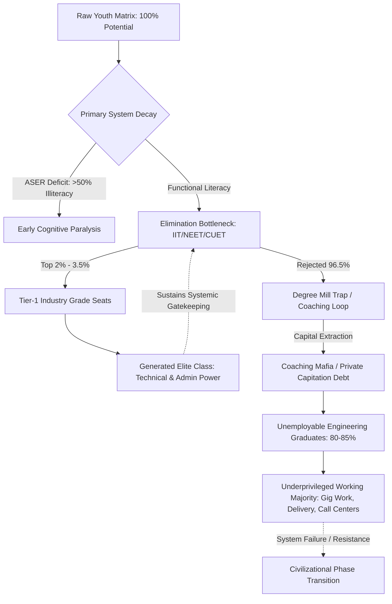

# SYSTEM LEDGER: VECTOR ANALYSIS OF EDUCATIONAL DECAY AND COMMODITY EXTRACTION
**LEDGER DOCUMENT ID:** `SYS-LEDGER-2026-EDU-EXTORTION-001`  
**SYSTEMIC VECTOR:** Systemic Ruin of Education and Commodity Extraction  
**EVALUATION ENGINE:** Local Empirical Matrix (India Telemetry) $\otimes$ Universal Physics Matrix (Cognitive Anti-Entropy)  
**STATUS:** ACTIVE COMPILATION | UNADULTERATED PRODUCTION DATA

---

## 1. THE THERMODYNAMIC & UNIVERSAL LAWS OF COGNITIVE TRANSMISSION

### 1.1 Thermodynamic Axiom of Education
Education is neither a luxury commodity, a service sector, nor a bureaucratic policy framework. In universal physics, education functions as the primary **anti-entropic information transmission mechanism** of a civilization. Physical systems naturally degrade toward maximum entropy ($S \to \infty$). To prevent infrastructure breakdown and civilizational collapse, low-entropy cognitive patterns must be transmitted efficiently from mature nodes to developing nodes.

The rate of civilizational entropy increase is inversely proportional to the efficiency of the educational transmission pipeline:

$$\frac{dS_{$	ext{Civilization}$}}{dt} \propto \frac{1}{\eta_{$	ext{Edu}$}}$$

Where:
* $S_{$	ext{Civilization}$}$ is the total entropy state of the society.
* $\eta_{$	ext{Edu}$}$ represents the efficiency of non-distorted, low-noise cognitive transmission across the human matrix.

### 1.2 Universal Distribution and Energy Barriers
Raw cognitive capacity and problem-solving potential are distributed uniformly across the human population matrix. Genius is non-localized and independent of zip code, socio-economic baseline, or legacy capital.

When artificial energy barriers (such as exorbitant capitation fees, artificial scarcity lotteries, and coaching paywalls) are constructed around the learning process, the transmission efficiency $\eta_{$	ext{Edu}$}$ drops toward zero. Clamping down on $95\%+$ of the population matrix induces severe structural resistance, converting cognitive potential into static friction, psychological trauma, and civilizational heat death.

### 1.3 The Sovereignty Triad Dependency ($TI$)
The total sovereignty index ($TI$) of a civilization is a non-linear product of its Political Independence ($PI$), Economic Independence ($EI$), and Social Independence ($SI$). 

$$TI = (PI + EI + SI) \times (PI \times EI \times SI)$$

Under current local empirical parameters where $PI = 0.90$, $EI = 0.08$ (driven by credential debt and zero-skill degree production), and $SI = 0.70$ (eroded by elimination despair):

$$TI = (0.90 + 0.08 + 0.70) \times (0.90 \times 0.08 \times 0.70)$$

$$TI = 1.68 \times 0.0504 = 0.084672$$

A total sovereignty index of $TI \approx 0.0847$ indicates catastrophic failure of sovereign resilience:
* **Political Collapse ($PI$):** Uneducated, non-critical population nodes become highly vulnerable to demagoguery and hyper-polarization.
* **Economic Collapse ($EI \to 0.08$):** Youth incur massive personal debt without gaining functional engineering, scientific, or algorithmic capabilities, forcing reliance on external technological powers.
* **Social Collapse ($SI$):** Hyper-competitive elimination drives systemic alienation, mental health crises, and social fragmentation.

---

## 2. LOCAL EMPIRICAL DIAGNOSIS: FOUNDATIONAL DECAY TO HYPER-INFLATION

### 2.1 Foundational Primary & Secondary Systemic Ruin
The empirical baseline of public foundational education displays severe structural atrophy:

* **Learning Deficits (ASER Data):** Over $50\%$ of Grade 5 students in rural public primary schools cannot read a Grade 2 textbook or execute basic 3-digit division.
* **Multigrade Classrooms & Shrinkage:** $66\%$ of Grade I & II public primary classrooms operate under multigrade setups (a single teacher simultaneously instructing multiple age groups). Over $52\%$ of primary schools enroll fewer than $60$ total students due to mass flight toward low-fee private degree mills.
* **Teacher Vacancies:** Over $1,000,000+$ ($10\text{ Lakh}$) sanctioned public teaching posts remain permanently vacant nationwide.

### 2.2 Public University Cut-Off Hyper-Inflation
The public higher education infrastructure suffers from severe capacity bottlenecks:

* **Central University Gatekeeping (CUET UG):** Cut-off scores for elite public institutions (e.g., DU North Campus: SRCC, Hindu, Hansraj, St. Stephen's) sit at $98.5\%$ to $99.8\%$ percentile ($780$	ext{--}$795+/800$) for general category aspirants.
* **Capacity Bottleneck:** Premier public university seats accommodate less than $1.5\%$ of the $40,000,000+$ annual applicants nationwide, producing artificial scarcity.

### 2.3 The Extreme Elimination Matrix
Higher education admission in India is structured as a non-productive elimination lottery rather than a diagnostic qualification process.

| Examination | Applicant Pool | Sanctioned Quality Seats | Rejection Rate (%) | Primary Failure Mode |
| :--- | :--- | :--- | :--- | :--- |
| **UPSC CSE** | $\sim 1,300,000$ | $\sim 1,000$ | **$99.92\%$** | Civil service choke-point; systemic life-year burn |
| **IIT-JEE Advanced** | $\sim 1,450,000$ | $\sim 17,500$ | **$98.80\%$** | Rote factory optimization; early burnout |
| **NEET-UG (Medical)** | $\sim 2,400,000$ | $\sim 55,000$ (Govt) | **$97.71\%$** | Paper leaks; capitation fee coercion |
| **CAT (IIM Management)**| $\sim 330,000$ | $\sim 5,500$ | **$98.34\%$** | Hyper-quant gatekeeping; credentials over skill |

---

## 3. THE TRIAD OF EDUCATIONAL EXTORTION & COMMODITY INVERSION

### 3.1 The Extortion Mechanics
The privatization and commodification of education operate through two primary extraction axes:

```
                            [RAW COGNITIVE POOL]
                                     |
           +-------------------------+-------------------------+
           |                                                   |
           v                                                   v
  [AXIS 1: TEST-PREP MAFIA]                           [AXIS 2: CAPITATION MAFIA]
- Capital Extraction: ₹1.0L Cr to ₹3.5L Cr           - Private MBBS: ₹50L to ₹1.5+ Cr
- Mechanics: 12-14 hr Rote Factories                 - Substandard Instruction & Curricula
- Infrastructure: "Dummy School" Arrangements        - Financial Destitution via Debt
           |                                                   |
           +-------------------------+-------------------------+
                                     |
                                     v
                        [SIGNAL TRANSMISSION COLLAPSE]
                        - High Noise / Low Signal
                        - Rote Memorization
                        - Manufactured Scarcity
```

* **Axis 1 (Test-Prep & Coaching Mafia):** Capital extracts $\text{₹}1.0\text{ Lakh Crore}$ to $\text{₹}3.5\text{ Lakh Crore}$ ($\$12$	ext{B}$$	ext{--}$\$42\text{B USD}$) annually directly from household savings. It enforces 12–14 hour rote factories via "dummy school" arrangements that bypass secondary schooling regulations.
* **Axis 2 (Private Seat & Capitation Fee Mafia):** Medical education requires $\text{₹}50\text{ Lakh}$ to $\text{₹}1.5+\text{ Crore}$ for private/deemed university seats. Engineering and management degrees cost $\text{₹}10\text{ Lakh}$ to $\text{₹}25\text{ Lakh}$ for outdated, low-grade curricula.

### 3.2 Commodity Inversion: Signal vs. Noise Transformation
When education is inverted from a public anti-entropic system into a private financial asset, its fundamental operational objective flips:

$$\text{Objective Shift: } $	ext{Capability Maximization}$ \longrightarrow \text{Gatekeeping Extraction}$$

* **Signal Transmission (True Learning):** Deep conceptual mastery, algorithmic intuition, critical enquiry, scientific method, and civic agency.
* **Noise Generation (Commodified Learning):** Rote pattern recognition, test-trick speed optimization, credential inflation, manufactured paper leaks, and elimination lotteries.

---

## 4. SYSTEMIC BOTTLENECK & CLASS GENERATION FLOWCHART

The system intentionally restricts access to actual skill acquisition, generating an artificial skill floor that acts as the primary driver of class division.



---

## 5. HUMAN COST TELEMETRY & SYSTEMIC INTEGRITY BREACHES

### 5.1 Physiological & Mental Toll Metrics
The human telemetry associated with elimination lotteries indicates structural systemic violence against the youth cohort:

* **Student Suicides (NCRB Data):** National Crime Records Bureau registers $>13,000$ student suicides annually ($>35$ deaths per day; 1 suicide every 40 minutes).
* **Exam Failure Mortalities:** $12,598$ youth deaths ($<30$ years old) are officially documented as directly caused by examination failure over a 5-year tracking window.
* **Batch Toxicity Index:** Public rank scoreboards, color-coded student uniforms based on mock exam scores, and "Star vs. Lower Batch" segregation cause clinical depression, panic disorders, and early-onset hypertension in $40\%$	ext{--}$50\%$ of enrolled aspirants.

### 5.2 The Paper Leak Scam Matrix
The collapse of testing integrity destroys the baseline social contract of meritocratic evaluation:

* **Scale of Disruption:** Over $70+$ major recruitment and competitive entrance exam paper leaks recorded across $15+$ states (including NEET-UG, REET Rajasthan, UP Police Constable, Bihar BPSC, SSC CGL), impacting $>15,000,000$ to $20,000,000$ aspirants.
* **Institutional Breakdown:** Dark-channel leaks, illicit mark inflation ($67$ perfect scores of $720/720$ in NEET-UG), and arbitrary grace marks erode faith in testing agencies such as the National Testing Agency (NTA).
* **Enforcement Deficit:** Legislative patches like the *Public Examinations (Prevention of Unfair Means) Act, 2024* fail to dismantle the structural nexus between state actors, exam centers, and the coaching mafia.

---

## 6. THE CATTLE FODDER PARADOX & REVISED CLASS THEORY

### 6.1 Surface Illusion vs. Employability Reality
The education market creates a fraudulent surface equilibrium:

* **The Paper Illusion:** $1,490,000$ approved undergraduate engineering seats versus $1,450,000$ JEE registered applicants presents an apparent surface ratio of $\approx 1:1$.
* **The Quality Rejection Reality:** Only $\sim 52,500$ seats ($\sim 3.5\%$) across IITs, NITs, and Tier-1 public institutions provide industry-grade technical training.
* **Employability Benchmark:** National skill assessments confirm that only **$3.84\%$** of engineering graduates possess industry-grade software/algorithmic problem-solving capability. Over **$80\%$ to $85\%$** remain structurally unemployable in the high-value knowledge economy.

```
       [TOTAL APPROVED SEATS: 14.90 LAKH]
       ===================================================  100%
       |                                                 |
       |  SUBSTANDARD DEGREE MILLS / UNEMPLOYABLE BASE   |  80.0% - 85.0% Unemployable
       |  (Gig Work, Non-Technical Call Centers)         |
       |                                                 |
       ===================================================  15%
       |  MODERATE INDUSTRY FIT                          |  11.5%
       ===================================================  3.84%
       |  INDUSTRY-GRADE ALGORITHMIC SKILL               |  3.84%
       ===================================================  0%
```

### 6.2 Structural Class Theory Revision
19th-century Marxian economic theory placed the engine of class division on the *Factory Floor* (ownership of physical means of production).

The Universal Physics Matrix updates this framework for the knowledge economy: **The Skill Floor is the primary Class Generator.**

$$\text{Skill Floor Restriction (2%--5% Threshold)} \Longrightarrow \text{Systemic Class Bifurcation}$$

1. **The Cause:** Artificial restriction of access to functional skills via extreme elimination lotteries and privatized paywalls.
2. **The Effect:** Systematic generation of a hyper-concentrated elite ($2\%$	ext{--}$5\%$) and a manufactured, indebted, low-wage majority ($95\%$	ext{--}$98\%$).
3. **The Destination:** Families liquidate ancestral assets or take high-interest loans for degree mills, only for graduates to be pushed into gig delivery, entry-level telemarketing, or chronic unemployment.

---

## 7. YOUTH RESISTANCE TELEMETRY & PHASE TRANSITION

### 7.1 Street Telemetry & Conflict Dynamics
The tension between the youth population matrix and state testing apparatus has escalated into direct civil instability:

* **Mobilization Vectors:** Student-led *Sansad Chalo* marches, persistent Jantar Mantar rallies, and mobilization by collective bodies (e.g., CJP) contesting paper leaks, score manipulation, and NTA corruption.
* **State Suppression Tactics:** Heavy perimeter barricading, targeted internet suspensions in central Delhi, lathi-charges, and mass detentions of student union organizers.

### 7.2 The Moral Slogans of Resistance
The moral demand of the movement rejects commodification and demands systemic structural redesign:

> "Education is Not a Commodity"

> "Empathy Over Empire"

> "Free, Fair & Quality Education is a Right of All"

### 7.3 Civilizational Phase Transition Boundaries
When the liberation gateway of education is blocked, society reaches a thermodynamic phase boundary:

1. **Internal Stagnation Decay:** Deprived of functional capability, the civilizational base loses the capacity to maintain complex infrastructure, leading to industrial, scientific, and institutional decline.
2. **Mass Systemic Inversion:** The youth cohort recognizes that the meritocratic social contract is unviable. Energy shifts from internal competition within the system to active systemic confrontation against state and market gatekeepers.

---

## 8. DIRECTIVE RECONSTRUCTION FRAMEWORK

To restore civilizational anti-entropy and return $\eta_{$	ext{Edu}$}$ to optimal operational capacity, the system requires structural transformation:

* **Elimination Matrix Deconstruction:** Replace single-point high-stakes hyper-elimination lotteries with decentralized, diagnostic qualification tracks.
* **Coaching Mafia Eradication:** Criminalize "dummy schools," ban score-based student rank-segregation, and mandate public funding parity for primary and secondary infrastructure.
* **Quality Seat Scaling:** Expansion of Tier-1 university infrastructure by an order of magnitude ($10\times$) to align quality supply with total student capacity.
* **Sovereignty Target Realization:** Rebalance the Sovereignty Triad to drive $EI \ge 0.85$ and restore national civilizational autonomy.

---

**[END OF SYSTEM LEDGER: VECTOR ANALYSIS COMPLETE]**