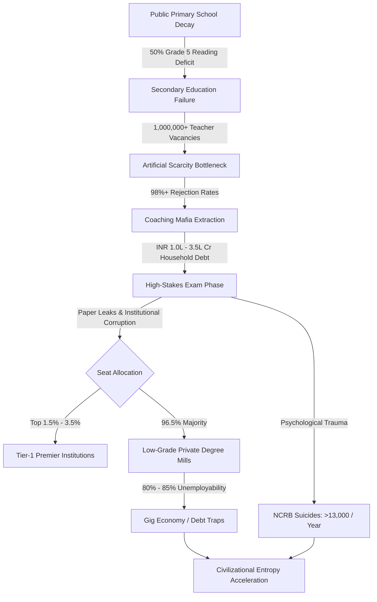

# SYSTEM LEDGER: SYSTEMIC RUIN OF EDUCATION AND COMMODITY EXTRACTION
**SYSTEMIC VECTOR IDENTIFIER:** `EDU-EXTRACT-2026-V1`  
**COMPILATION METRIC:** UNIVERSAL COGNITIVE THERMODYNAMICS & LOCAL EMPIRICAL AGGREGATION  
**SECURITY/EXECUTION STATUS:** CONTINUOUS TELEMETRY LIVE TRACKING ENGAGED  

---

## 1. EXECUTIVE MATHEMATICAL & PHYSICAL FRAMEWORK

### 1.1 Thermodynamic Law of Cognitive Transmission
Education is not an administrative service, a market sector, or a revenue engine. It constitutes the fundamental anti-entropic information transmission mechanism of a civilization. Physical systems naturally decay toward maximum entropy ($S \to \infty$). To preserve technical, physical, and moral infrastructure, low-entropy cognitive patterns must be transferred efficiently from mature nodes to developing nodes.

The rate of civilizational entropy production is inversely proportional to the efficiency of the educational transmission matrix:

$$\frac{dS_{$	ext{Civilization}$}}{dt} \propto \frac{1}{\eta_{$	ext{Edu}$}}$$

Where $\eta_{$	ext{Edu}$}$ represents the systemic efficiency of cognitive transmission. When education is converted into a privatized commodity, $\eta_{$	ext{Edu}$} \to 0$, driving civilizational entropy $S_{$	ext{Civilization}$}$ toward accelerated collapse.

### 1.2 Invariant Distribution of Cognitive Potential & Energy Barriers
Raw cognitive capacity, creative potential, and high-order intelligence are distributed uniformly across the human population matrix. Genius is not spatially or economically localized.

A resilient civilization requires unobstructed circulation of potential from any node to any function. The creation of artificial economic and institutional energy barriers—such as exorbitant tuition fees, private capitation fees, hyper-concentrated examination lotteries, and social gatekeeping—clamps down on $>95\%$ of the population matrix. This introduces severe structural resistance and cognitive paralysis across the collective body.

### 1.3 The Class Generator: Skill Floor Bottlenecking
Class stratification is generated by restricting access to high-quality skill acquisition at a strict numerical threshold. Revising classic economic models from the factory floor to the skill floor:

```
[Universal Population Matrix: 100%]
                 │
                 ▼
  [Skill Floor Access Threshold: 2% - 5%]  ───> Generates Elite Class
                 │
                 ▼
  [Artificially Restricted Base: 95% - 98%] ───> Manufactures Underprivileged Labor Base
```

Restricting skill floor access to $2\% - 5\%$ of the population matrix automatically generates an elite class. The artificial numerical restriction is the causal mechanism; elite class formation is the systemic effect. This restriction systematically manufactures an underprivileged, low-wage majority ($95\% - 98\%$), driving upstream economic inequality ($L_{$	ext{Gini}$} \approx 0.92$).

### 1.4 Signal Collapse: The Commodity Inversion
When education shifts from a public cognitive infrastructure to a privatized asset, its operational objective transforms from capability maximization to gatekeeping extraction and artificial scarcity:

*   **Signal Transmission (True State):** Focuses on operational capability, algorithmic problem-solving, creative synthesis, and ethical development.
*   **Noise Generation (Commodity State):** Focuses on rote memorization, high-stakes test gaming, credential acquisition without competence, and artificial elimination mechanics.

### 1.5 Sovereign Triad Dependency & Index Coupling
Systemic sovereignty depends on the Total Index ($TI$), defined by the non-linear coupling of Political Independence ($PI$), Economic Independence ($EI$), and Social Independence ($SI$):

$$TI = (PI + EI + SI) \times (PI \times EI \times SI)$$

Under current commodity extraction metrics where $PI = 0.90$, $EI = 0.08$ (reflecting mass credential debt and skill deficits), and $SI = 0.70$:

$$TI = (0.90 + 0.08 + 0.70) \times (0.90 \times 0.08 \times 0.70)$$

$$TI = 1.68 \times 0.0504 = 0.084672$$

An Economic Independence index of $EI = 0.08$ suppresses Total Sovereignty to $TI \approx 0.0847$, demonstrating that civilizational sovereignty collapses when the educational system fails to generate real economic capability.

---

## 2. LOCAL EMPIRICAL BREAKDOWN: FOUNDATIONAL DECAY & ELIMINATION MATRIX

### 2.1 Primary & Secondary Foundational Decay
*   **Learning Deficits (ASER Data):** Over $50\%$ of Grade 5 students in rural public schools are unable to read a Grade 2 level textbook or perform basic 3-digit by 1-digit division.
*   **Multigrade Classrooms & Shrinkage:** $66\%$ of Grade I and II public primary classrooms operate on multigrade setups, where a single teacher simultaneously instructs multiple age groups. Over $52\%$ of public primary schools register fewer than 60 total enrolled students due to widespread parental flight to low-fee private institutions.
*   **Teacher Vacancies:** Over $1,000,000+$ ($10\text{ Lakh}$) sanctioned public primary and secondary teaching posts remain unfilled across the nation.

### 2.2 Public University Cut-Off Hyper-Inflation
*   **Central University Gatekeeping (CUET UG):** Cut-off scores for premier public institutions (e.g., DU North Campus: SRCC, Hindu, Hansraj, St. Stephen's) range from $98.5\%$ to $99.8\%$ percentile ($780 - 795+ / 800$) for general candidates in high-demand programs.
*   **Public Capacity Bottleneck:** Premier public higher education capacity accommodates less than $1.5\%$ of the $40,000,000+$ national applicant pool, creating artificial scarcity at the entry point of higher learning.

### 2.3 Empirical Analysis: The Extreme Elimination Matrix

| Examination / Gateway | Candidate Pool (Annual) | Available Top-Tier Seats | Rejection Rate (%) | Systemic Function |
| :--- | :--- | :--- | :--- | :--- |
| **UPSC Civil Services (CSE)** | $1,300,000$ | $1,000$ | **$99.92\%$** | Hyper-Elimination / Administrative Gatekeeping |
| **IIT-JEE Advanced** | $1,450,000$ | $17,500$ | **$98.80\%$** | Technological Capability Bottlenecking |
| **NEET-UG (Medical - Govt)** | $2,400,000$ | $55,000$ | **$97.71\%$** | Healthcare Seat Rationing |
| **CAT (IIM Management)** | $330,000$ | $5,500$ | **$98.34\%$** | Corporate Leadership Filter |

---

## 3. THE TRIAD OF EXTORTION & THE PAPER LEAK MATRIX

### 3.1 The Triad of Educational Extortion
1.  **Axis 1: Test-Prep & Coaching Mafia**
    *   Annual Household Extraction: $\text{INR } 1.0 \text{ Lakh Crore}$ to $\text{INR } 3.5 \text{ Lakh Crore}$ ($\$12$	ext{B}$ - \$42\text{B USD}$).
    *   Operational Mechanics: Enforces 12–14 hour daily rote factories through "dummy school" arrangements, neutralizing secondary schooling into pure test preparation.
2.  **Axis 2: Private Seat & Capitation Fee Extraction**
    *   Medical Sector: Cost for private or deemed university MBBS seats ranges from $\text{INR } 50 \text{ Lakh}$ to $\text{INR } 1.5+ \text{ Crore}$.
    *   Engineering & Management Sector: Substandard private degrees cost between $\text{INR } 10 \text{ Lakh}$ and $\text{INR } 25 \text{ Lakh}$ for outdated curricula and minimal operational infrastructure.
3.  **Axis 3: Institutional Credential Gaming**
    *   Conversion of educational credentials into high-cost financial products without guaranteeing baseline capability or industry deployment.

### 3.2 The Exam Integrity & Paper Leak Scam Matrix
*   **Scale of Disruption:** Over $70+$ major competitive and recruitment examination leaks recorded across $15+$ state jurisdictions (including NEET-UG, REET Rajasthan, UP Police Constable, Bihar BPSC, SSC CGL).
*   **Target Population Affected:** Direct systemic disruption impacting $15,000,000$ to $20,000,000$ student applicants.
*   **Institutional Breakdown:** Operations involving dark-channel distribution, compromised exam centres, inflated maximum scores (e.g., 67 simultaneous perfect 720/720 scores in NEET-UG), and arbitrary grace mark allocations.
*   **Enforcement Deficit:** Legislative frameworks such as the *Public Examinations (Prevention of Unfair Means) Act, 2024* remain structurally ineffective at dismantling state-coaching network links.

---

## 4. THE CATTLE FODDER PARADOX & STRUCTURAL EMPLOYABILITY FAILURE

### 4.1 Surface Metrics vs. Real Quality Breakdown
*   **The Paper Equilibrium:** $1,490,000$ approved undergraduate engineering seats versus $1,450,000$ JEE registered candidates displays an apparent $1:1$ capacity-to-demand ratio.
*   **The Quality Rejection Reality:** Only $\sim 52,500$ seats ($\sim 3.5\%$) across IITs, NITs, and Tier-1 public institutions offer industry-aligned educational infrastructure.

```
Total Approved Seats: 1,490,000 [100%]
├── Quality Seats (IIT/NIT/Tier-1): 52,500 [3.5%]
└── Low-Grade Degree Mills: 1,437,500 [96.5%]
```

### 4.2 Employability Benchmarks & Economic Redirection
*   **Algorithmic Capability Index:** Only $3.84\%$ of graduating engineering students demonstrate industry-grade software development and algorithmic problem-solving skills.
*   **Unemployability Rate:** Over $80\%$ to $85\%$ of technical graduates are unemployable in the high-value knowledge economy.
*   **Economic Realignment:** $96.5\%$ of higher education seats operate as fee-extraction degree mills. Families liquidate generational savings or take high-interest private debt, only for graduates to enter low-wage gig platforms, food delivery services, or non-technical call centers.

---

## 5. PSYCHOLOGICAL TELEMETRY & HUMAN COST

### 5.1 NCRB Mortality Data
*   **Annual Student Suicides:** National Crime Records Bureau (NCRB) tracking confirms $>13,000$ student suicides per year ($>35$ daily deaths; approximately 1 death every 40 minutes).
*   **Exam Failure Mortalities:** $12,598$ youth deaths (under 30 years old) officially recorded as directly caused by examination failure within a 5-year tracking window.

### 5.2 Micro-Level Batch Toxicity Metrics
*   **Segregation Mechanics:** Coaching centers enforce weekly public ranking boards, color-coded student uniforms, and strict physical separation into "Star Batches" versus "Lower Batches".
*   **Clinical Telemetry:** $40\%$ to $50\%$ of enrolled aspirants exhibit clinical symptoms of major depressive disorder, panic disorders, and stress-induced early-onset hypertension.

---

## 6. SYSTEMIC PROCESS FLOW & EXTRACTION PIPELINE



---

## 7. YOUTH RESISTANCE, STREET TELEMETRY & SYSTEMIC PHASE TRANSITION

### 7.1 Street Telemetry & Suppression Metrics
*   **Mobilization Vectors:** Student-led *Sansad Chalo* marches, Jantar Mantar assemblies, and coordinated campaigns by organizations such as the Central Joint Panel (CJP) against paper leaks and institutional testing failures.
*   **State Suppression:** Physical containment using multi-layer barricades, temporary internet suspensions across central administrative zones, lathi-charges, and preventive detentions of student representatives.

### 7.2 Moral Demands & Demanded System Transformations
Street mobilization frames the crisis not as an administrative glitch, but as a fight for basic rights:

> "Education is Not a Commodity"

> "Empathy Over Empire"

> "Free, Fair & Quality Education is a Right of All"

### 7.3 Phase Transition Analysis
When access to human development is systematically restricted, civilizational dynamics undergo a phase shift across two distinct pathways:

1.  **Internal Stagnation & Structural Decay:** The elite class experiences credential inflation while the working base remains deprived of functional capability. The overall problem-solving capacity of the society drops below the threshold required to maintain critical infrastructure.
2.  **Mass Systemic Inversion:** As youth recognize that the skill floor is structurally rigged, collective energy shifts from compliance with high-stakes elimination tests toward active resistance and systemic realignment.

---

## 8. MASTER CONSOLIDATED METRIC MATRIX

```
========================================================================================
SYSTEM METRIC                               VALUE / IMPACT CODE
========================================================================================
Rural Public Grade 5 Reading Deficit        > 50.0%
Public Primary Multigrade Classrooms        66.0%
Sanctioned Teacher Vacancies                > 1,000,000 Posts
UPSC CSE Rejection Rate                     99.92%
IIT-JEE Advanced Rejection Rate             98.80%
NEET-UG Govt Seat Rejection Rate            97.71%
Coaching Mafia Annual Extraction            INR 1.0 Lakh Cr - 3.5 Lakh Cr ($12B - $42B)
Major Exam Paper Leaks Tracked              70+ Exams across 15+ States
Aspirants Affected by Leaks                 15,000,000 - 20,000,000
Engineering Graduates Industry Employable   3.84%
Engineering Degree Mill Proportion          96.5%
Annual Student Suicides (NCRB)              > 13,000 (> 35 / Day)
Calculated Systemic Triad Index (TI)        0.084672 (CRITICAL SYSTEMIC IMPAIRMENT)
========================================================================================
```

**[LEDGER COMPILATION END - SYSTEM DISPATCH READY]**