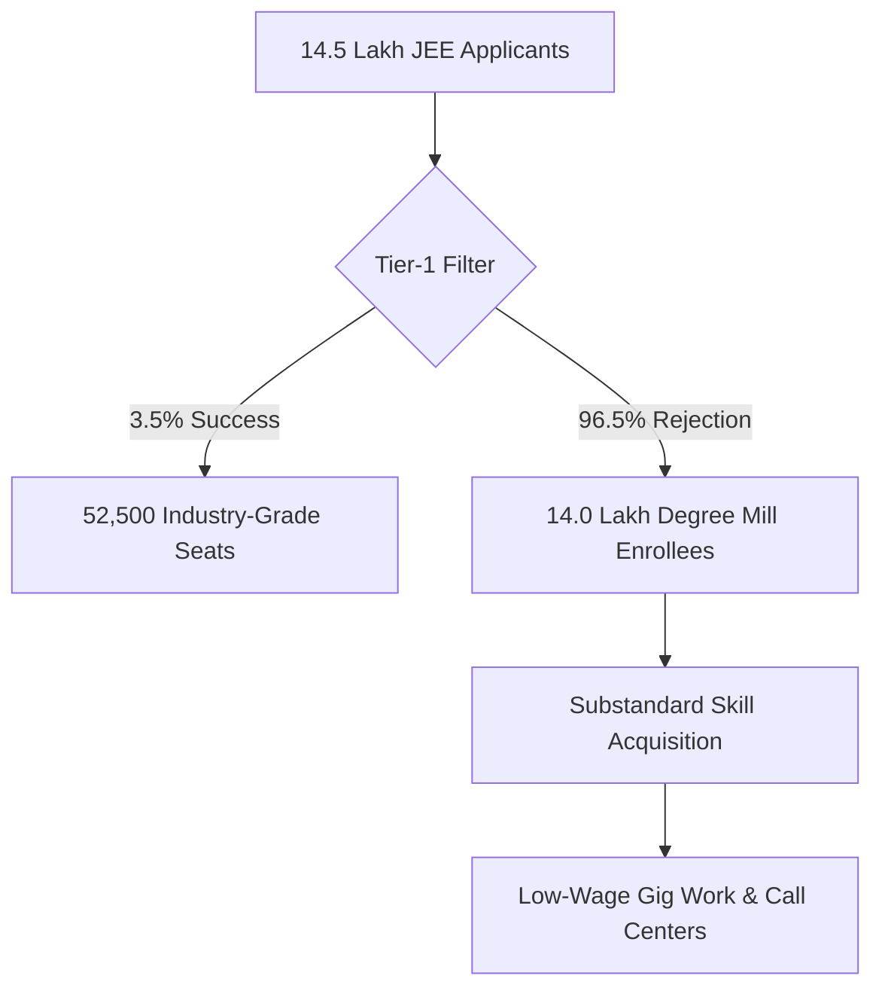
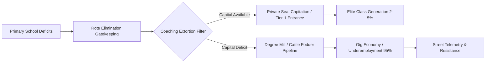

# SYSTEMIC AUDIT: THE RUIN OF EDUCATION AND COMMODITY EXTRACTION

---

## 1. EXECUTIVE SYSTEMIC AUDIT: THE COMMON MAN'S REALITY

For the ordinary citizen, education is sold as the single viable gateway out of generational poverty. Millions of families strip their savings, mortgage ancestral property, or incur high-interest debt to purchase entry into what is framed as a meritocratic ladder. However, systemic telemetry reveals that this ladder is an artificial elimination machine designed to extract private wealth while funneling 95% to 98% of the population into non-productive economic holding pens.

```
+-----------------------------------------------------------------------+
|                    THE ARTIFICIAL SCARCITY CYCLE                      |
|                                                                       |
|  [Public Systemic Decay] ---> [Parental Flight to Private Sector]    |
|            ^                                     |                    |
|            |                                     v                    |
|  [Hyper-Inflated Scarcity] <--- [Coaching & Capitation Extortion]     |
+-----------------------------------------------------------------------+
```

The transformation of learning from a fundamental public anti-entropic mechanism into a commodified asset has created a dual crisis: ground-level physiological destruction for youth and macro-level collapse of civilizational capability.

---

## 2. LOCAL EMPIRICAL ANALYSIS: THE EXTORTION MATRIX

### Foundational Decay & Public Systemic Collapse
The primary and secondary education foundation suffers from structural neglect, forcing families into the predatory private market:
* **Primary Reading & Math Deficits**: Over 50% of Grade 5 students in rural public schools cannot read a Grade 2 textbook or perform basic 3-digit division.
* **Multigrade Classrooms & Shrinkage**: 66% of Grade I and II public primary classrooms operate on multigrade arrangements where a single teacher simultaneously instructs multiple age groups. Over 52% of primary schools enroll under 60 total students due to mass parental flight to low-fee private institutions.
* **Teacher Vacancies**: More than 10 Lakh (1 Million+) sanctioned teaching posts remain vacant across public primary and secondary schools nationwide.

### Public University Gatekeeping & The Elimination Matrix
At the higher education level, extreme capacity bottlenecks artificially construct severe rejection rates:
* **CUET UG Inflation**: Cut-offs for top-tier public colleges routinely sit between 98.5% and 99.8% percentile ($780$	ext{--}$795+/800$) for general candidates in high-demand courses.
* **Public Capacity Bottleneck**: Premier public higher education seats represent less than 1.5% of the total 40 Million+ applicants nationwide.

| Examination Matrix | Applicants | Available Premier Seats | Rejection Rate |
| :--- | :--- | :--- | :--- |
| **UPSC Civil Services (CSE)** | ~13.0 Lakh | ~1,000 | **99.92%** |
| **IIT-JEE Advanced** | ~14.5 Lakh | ~17,500 | **98.80%** |
| **NEET-UG (Medical)** | ~24.0 Lakh | ~55,000 (Govt MBBS) | **97.71%** |
| **CAT (IIM Management)** | ~3.3 Lakh | ~5,500 | **98.34%** |



### The Triad of Educational Extortion
1. **Axis 1 (Test-Prep & Coaching Mafia)**: Extracts ₹1.0 Lakh Crore to ₹3.5 Lakh Crore ($12$	ext{B}$$	ext{--}$42\text{B USD}$) annually from household savings through 12–14 hour daily rote factories supported by "dummy school" arrangements.
2. **Axis 2 (Private Seat & Capitation Fee Mafia)**: Private/deemed university MBBS seats range from ₹50 Lakh to ₹1.5+ Crore, while private engineering and management degrees cost ₹10 Lakh to ₹25 Lakh for substandard instruction.
3. **Axis 3 (Exam Integrity Breakdown)**: Over 70 major competitive and recruitment exam paper leaks recorded across 15+ states (NEET-UG, REET, UP Police, Bihar BPSC, SSC CGL) have directly impacted over 1.5 Crore to 2.0 Crore aspirants. Dark-channel leaks and unannounced grace marks erode institutional integrity.

### Human & Physiological Toll
* **Student Suicides**: National Crime Records Bureau (NCRB) data confirms >13,000 student suicides annually (>35 deaths per day; 1 every 40 minutes).
* **Exam Failure Mortalities**: 12,598 youth deaths (<30 years old) officially documented as directly caused by examination failure over a 5-year tracking window.
* **Batch Toxicity**: Weekly public rank boards, color-coded uniforms, and "Star vs. Lower Batch" segregation induce clinical depression, panic disorders, and early-onset hypertension in 40%–50% of coaching aspirants.

---

## 3. UNIVERSAL PHYSICS ANALYSIS: COGNITIVE TRANSMISSION & CLASS GENERATION

### Thermodynamic Law of Cognitive Transmission
Education is the primary anti-entropic information transmission mechanism of a human civilization. Physical systems naturally decay toward maximum entropy ($S \to \infty$). Low-entropy cognitive patterns must be transferred efficiently from mature to developing nodes to maintain physical, technical, and social infrastructure.

$$\frac{dS_{$	ext{Civilization}$}}{dt} \propto \frac{1}{\eta_{$	ext{Edu}$}}$$

When efficiency ($\eta_{$	ext{Edu}$}$) drops due to commercial gatekeeping, civilizational entropy ($S_{$	ext{Civilization}$}$) accelerates, leading to structural decay.

### Conservation of Cognitive Potential
Raw cognitive capacity is distributed uniformly across the human population matrix. Genius and problem-solving capacity are not localized to wealthy zip codes. Building artificial financial energy barriers clamps down on 95%+ of the population matrix, inducing severe structural resistance and cognitive paralysis across the collective body.

### Revising Class Generation Theory: The Skill Floor Bottleneck
Access to high-quality education and industry-grade skill acquisition is artificially restricted to a 2%–5% numerical threshold of the total population matrix. 

```
+-------------------------------------------------------------------+
|                     THE CLASS GENERATOR MATRIX                     |
|                                                                   |
|  [2%-5% Restricted Skill Floor]  ---> Generates Elite Class       |
|  [95%-98% Artificially Excluded] ---> Generates Low-Wage Majority |
+-------------------------------------------------------------------+
```

It is *because* of this numerical restriction that an elite class is generated. Bottlenecking the skill floor systematically manufactures an underprivileged, low-wage 95%–98% majority, driving upstream economic inequality ($L_{$	ext{Gini}$} \approx 0.92$, $EI \approx 0.08$, $TI \approx 0.0847$).

### Commodity Inversion: Signal vs. Noise
Converting learning into a privatized asset flips its objective from capability-maximization (Signal) to gatekeeping extraction and artificial scarcity (Noise):
* **Signal Transmission**: True understanding, physical problem-solving, technological innovation.
* **Noise Generation**: Rote memorization, credential gaming, artificial elimination tests, fake degree mills.

---

## 4. SYSTEM TELEMETRY & DATA COMPARISON

### Real-Time Metric Matrix

| Metric Dimension | Empirical Local Value | Universal Benchmark | Systemic Implication |
| :--- | :--- | :--- | :--- |
| **Primary Skill Acquisition** | >50% Grade 5 Illiteracy | 100% Foundational Literacy | Structural Collapse at Base |
| **Sanctioned Teacher Vacancy** | >1,000,000 Posts Vacant | 0% Unfilled Sanctioned Posts | Artificial Capacity Deficit |
| **Coaching Extortion Volume** | ₹1.0L Cr – ₹3.5L Cr / yr | $0 Direct Extortion | Household Capital Drain |
| **Industry-Grade Employability**| 3.84% Engineering Graduates| >80% Functional Competency | Degree Mill Illusion |
| **Student Suicides (NCRB)** | >13,000 Annually | 0 (System Induced) | Severe Human Toll |

### The Sovereignty Triad Dependency (TI Coupling)
The overall True Sovereignty Index ($TI$) is governed by the product of Political Independence ($PI$), Economic Independence ($EI$), and Social Independence ($SI$):

$$TI = (PI + EI + SI) \times (PI \times EI \times SI)$$

Given the current empirical parameters:
* $PI = 0.90$
* $EI = 0.08$ (Driven down by debt and lack of functional skills)
* $SI = 0.70$ (Eroded by hyper-competitive elimination and despair)

$$TI = (0.90 + 0.08 + 0.70) \times (0.90 \times 0.08 \times 0.70)$$

$$TI = (1.68) \times (0.0504) = 0.084672$$

The collapse of $EI$ to $0.08$ pulls the total civilizational sovereignty index down to **0.0847**, demonstrating that economic and educational degradation directly dismantles national sovereignty.

---

## 5. SYSTEMIC PIPELINE & RESISTANCE TELEMETRY



### Youth Resistance & Street Demands
Faced with paper leaks, hyper-inflated cutoffs, and structural extortion, student-led movements (Sansad Chalo march, Jantar Mantar mobilizations, CJP actions) have directly challenged national testing agencies and coaching-mafia nexuses despite state suppression, barricading, and detentions.

> "Education is Not a Commodity"

> "Empathy Over Empire"

> "Free, Fair and Quality Education is a Right of All"

---

## 6. SYNTHESIS & CONCLUSION

The conversion of education into a extortionate lottery sabotages the republic's sovereign future. When 96.5% of higher education seats act as non-functional degree mills and elite access is artificially bottlenecked to generate class division, the cognitive transmission of society breaks down.

To halt civilizational entropy, education must be restored as a universal public necessity—removing artificial energy barriers, dismantling predatory extraction loops, and guaranteeing baseline capability transmission across the entire population matrix.