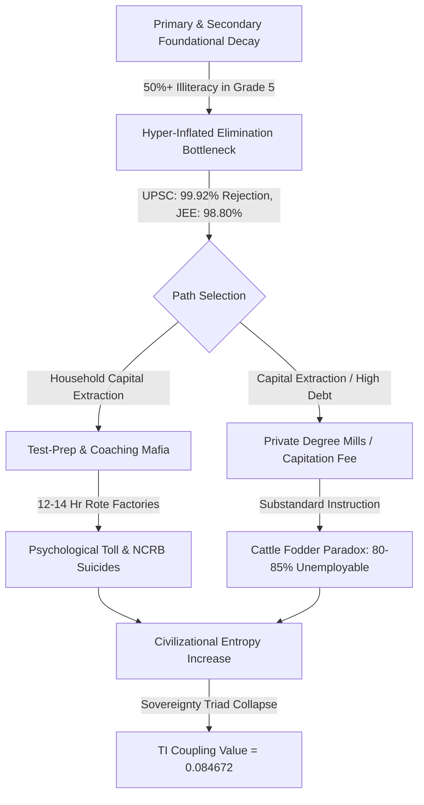

# SYSTEMIC LEDGER: SYSTEMIC RUIN OF EDUCATION AND COMMODITY EXTRACTION

## 1. SYSTEMIC LEDGER IDENTIFICATION & TELEMETRY MATRIX

```
========================================================================================
SYSTEM LEDGER PROTOCOL          : COMPREHENSIVE COGNITIVE EXTRACTION ASSESSMENT
TARGET SYSTEM VECTOR            : SYSTEMIC RUIN OF EDUCATION & COMMODITY EXTRACTION
TEMPORAL BASELINE               : 2026 STATE VARIABLES
ANALYTIC SCOPE                  : LOCAL EMPIRICAL MATRIX (INDIA) + UNIVERSAL PHYSICS MATRIX
PRIMARY THERMODYNAMIC METRIC    : dS_Civilization / dt ∝ 1 / η_Edu
SOVEREIGNTY COUPLING EVALUATION : TI = (PI + EI + SI) × (PI × EI × SI) = 0.084672
========================================================================================
```

---

## 2. UNIVERSAL THERMODYNAMIC & MATHEMATICAL FORMULATION OF COGNITIVE TRANSMISSION

### 2.1 The Anti-Entropic Axiom of Education
Education is not a commercial service, a market vertical, or a mere policy administrative tool. Education is the primary anti-entropic information transmission mechanism of a physical civilization.

In accordance with fundamental thermodynamics, closed physical and social systems naturally decay toward maximum structural disorder:

$$\lim_{t \to \infty} S_{\text{Civilization}} = \infty$$

To prevent civilizational collapse, low-entropy cognitive patterns, functional algorithms, and moral structures must be transferred efficiently from mature nodes (instructors/institutions) to developing nodes (students). The rate of civilizational entropy increase is inversely proportional to the efficiency of the educational transmission pipeline:

$$\frac{dS_{\text{Civilization}}}{dt} \propto \frac{1}{\eta_{\text{Edu}}}$$

where $\eta_{\text{Edu}}$ represents the true cognitive transmission efficiency of the educational architecture.

### 2.2 Uniformity of Cognitive Distribution and Artificial Barriers
Raw cognitive potential, spatial logic, creative insight, and algorithmic capacity are distributed uniformly across the human population matrix. Higher potential is not concentrated within specific socioeconomic strata or geographical zip codes.

$$\int_{\text{Node}_{\text{Low}}}^{\text{Node}_{\text{High}}} \Psi_{\text{Potential}} \, dN = \text{Constant}$$

When artificial energy barriers (such as hyper-inflated capitation fees, artificial elimination bottlenecks, and privatized gatekeeping) are erected around learning access, the system clamps down on over $95\%$ of the population matrix. This induces severe internal resistance:

$$R_{\text{System}} \propto \frac{1}{\text{Access}_{\text{Open}}}$$

This structural clamping halts the circulation of cognitive potential, trapping the collective body in systemic paralysis.

---

## 3. LOCAL EMPIRICAL DECAY MATRIX (INDIA FOUNDATIONAL & HIGHER EDUCATION)

### 3.1 Primary and Secondary Foundational Decay
- **Learning Deficits (ASER Telemetry):** Over $50\%$ of Grade 5 students in rural public schools are incapable of reading a Grade 2 textbook or solving basic 3-digit division problems.
- **Multigrade Classrooms and School Shrinkage:** $66\%$ of Grade I and II public primary classrooms operate on multigrade setups where a single instructor simultaneously teaches multiple grades. Over $52\%$ of primary schools have fewer than $60$ total enrolled students due to mass parental flight to low-fee private institutions.
- **Teacher Vacancies:** Over $1,000,000+$ ($10\text{ Lakh+}$) sanctioned teacher posts remain vacant across public primary and secondary schools nationwide.

### 3.2 Public University Cut-Off Hyper-Inflation
- **Central University Gatekeeping (CUET UG):** Cut-offs for premier public colleges (e.g., DU North Campus: SRCC, Hindu, Hansraj, St. Stephen's) sit between $98.5\%$ and $99.8\%$ percentile ($780\text{--}795+/800$) for general candidates in high-demand courses.
- **Public Capacity Bottleneck:** Premier public higher education seats represent less than $1.5\%$ of the $40,000,000+$ applicants nationwide, manufacturing artificial scarcity.

---

## 4. THE EXTREME ELIMINATION MATRIX & CATTLE FODDER PARADOX

### 4.1 Statistical Breakdown of Competitive Elimination

| Examination Vector | Candidate Pool | Seats Available | Rejection Rate (%) | Structural Mechanism |
| :--- | :--- | :--- | :--- | :--- |
| **UPSC Civil Services (CSE)** | $1,300,000$ | $\approx 1,000$ | $99.92\%$ | Hyper-elimination administrative gatekeeping |
| **IIT-JEE Advanced** | $1,450,000$ | $\approx 17,500$ | $98.80\%$ | Extreme algorithmic filtering under artificial speed constraints |
| **NEET-UG (Medical)** | $2,400,000$ | $\approx 55,000$ (Govt MBBS) | $97.71\%$ | Rote memory hyper-saturation under single-test pressure |
| **CAT (IIM Management)** | $330,000$ | $\approx 5,500$ | $98.34\%$ | Time-pressured quantitative and verbal elimination |

### 4.2 The Cattle Fodder Paradox (The Fake Equilibrium)
The surface ratio of engineering seats to applicants appears balanced:
- **Total Approved UG Engineering Seats:** $1,490,000$
- **Total JEE Registered Applicants:** $1,450,000$
- **Surface Equilibrium Ratio:** $\approx 1:1$

**The Reality of Quality Rejection:**
- Only $\approx 52,500$ seats ($\approx 3.5\%$) across IITs, NITs, and Tier-1 public/private institutions offer viable, industry-grade instruction.
- **Employability Benchmark:** Only $3.84\%$ of engineering graduates possess industry-grade software and algorithmic skills. Over $80\%\text{--}85\%$ remain unemployable in the high-value knowledge economy.
- **Structural Function:** $96.5\%$ of total available seats function as private degree mills. Families exhaust ancestral savings or incur massive personal loans, only for graduates to be dumped into low-wage gig work, delivery fleets, or non-technical support centers.

---

## 5. STRUCTURAL CLASS GENERATION & COMMODITY INVERSION METRICS

### 5.1 The Class Generator Formulation
Access to functional, high-quality education and skill acquisition is artificially choked at a strict $2\%\text{--}5\%$ numerical threshold of the total population matrix. 

```
                                  [ TOTAL CANDIDATE MATRIX ]
                                         (100% / ~40M+)
                                               │
                                               ▼
                              ┌─────────────────────────────────┐
                              │  ARTIFICIAL SKILL FLOOR CHOKE   │
                              │   (Fee Barriers & Elimination)  │
                              └────────────────┬────────────────┘
                                               │
                       ┌───────────────────────┴───────────────────────┐
                       ▼                                               ▼
          [ CAPABILITY FLOOR ELITE ]                      [ MANUFACTURED UNDERPRIVILEGED ]
               (2% - 5% Access)                                   (95% - 98% Base)
                       │                                               │
                       ▼                                               ▼
         Sovereign Capability & Wealth                  Low-Wage Gig Work & Mass Debt
```

This structural choking generates an elite class within that $2\%\text{--}5\%$ space. The restriction is the cause; the elite is the effect. By bottlenecking the skill floor, the system systematically manufactures an underprivileged, low-wage $95\%\text{--}$98\%$ majority, driving extreme economic inequality:

$$L_{\text{Gini}$} \approx 0.92, \quad EI \approx 0.08, \quad TI \approx 0.0847$$

### 5.2 Commodity Inversion: Signal vs. Noise
When education is converted into a privatized asset, its objective transforms from capability maximization to extraction and gatekeeping.

$$\text{Transmission State}$ = \begin{cases} \text{Signal Transmission}$ & \text{if }$ \eta_{\text{Edu}$} \to 1 \text{ (Problem Solving, Innovation)}$ \\ \text{Noise Generation}$ & \text{if Privatized}$ \text{ (Rote Memorization, Credential Gaming)}$ \end{cases}$$

### 5.3 Extortion Triad and Paper Leak Scams
- **Axis 1 (Test-Prep Coaching Mafia):** Extracts ₹$1.0\t\text{ Lakh Crore}$ to ₹$3.5\t\text{ Lakh Crore}$ ($\$12\text{B}$\text{--}$\$42\t\text{B USD}$) annually from household savings through "dummy school" arrangements and $12\text{--}$14$ hour daily rote factories.
- **Axis 2 (Private Seat and Capitation Fee Mafia):** Private MBBS seats range from ₹$50\t\text{ Lakh}$ to ₹$1.5+\t\text{ Crore}$; private engineering/management degrees cost ₹$10\t\text{ Lakh}$ to ₹$25\t\text{ Lakh}$ for substandard instruction.
- **Paper Leak Matrix:** Over $70+$ major competitive and recruitment exam paper leaks recorded across $15+$ states (NEET-UG, REET Rajasthan, UP Police Constable, Bihar BPSC, SSC CGL), directly disrupting $>15,000,000\text{ to }$20,000,000$ aspirants. Dark-channel leaks, inflated top scores ($67$ perfect $720$s in NEET), and unannounced grace marks completely destroy trust in national testing agencies. Legislative measures like the Public Examinations (Prevention of Unfair Means) Act, 2024 fail to dismantle the underlying state-coaching nexuses.

---

## 6. DIAGRAMMATIC FLOW OF SYSTEMIC DECAY & EXTRACTION



---

## 7. SOVEREIGNTY TRIAD DEPENDENCY (TI COUPLING) ANALYSIS

### 7.1 Mathematical Coupling Formula
Civilizational sovereignty is governed by the Interdependent Triad Index ($TI$), which couples Political Independence ($PI$), Economic Independence ($EI$), and Social Independence ($SI$):

$$TI = (PI + EI + SI) \times (PI \times EI \times SI)$$

### 7.2 Variable Telemetry Values
- **Political Independence ($PI$):** $0.90$ (High formal sovereignty, but vulnerable to demagoguery and cognitive manipulation due to uneducated baseline nodes).
- **Economic Independence ($EI$):** $0.08$ (Severe degradation due to mass debt, low-skill floor, and $80\%\text{--}$85\%$ unemployability of degree holders).
- **Social Independence ($SI$):** $0.70$ (Eroding under hyper-competitive elimination, public humiliation, and youth psychological distress).

### 7.3 Quantitative Evaluation
Inserting the telemetry parameters into the coupling equation:

$$TI = (0.90 + 0.08 + 0.70) \times (0.90 \times 0.08 \times 0.70)$$

$$TI = (1.68) \times (0.0504)$$

$$TI = 0.084672$$

**Systemic Interpretation:** The resulting True Sovereignty Index ($TI \approx 0.0847$) demonstrates that an educational system converted into an extortionate lottery sabotages the republic's sovereign future. It locks the civilization into technological dependency and structural weakness.

---

## 8. HUMAN COST, PSYCHOLOGICAL TOLL & RESISTANCE TELEMETRY

### 8.1 NCRB Mortality Telemetry
- **Annual Student Suicides:** National Crime Records Bureau (NCRB) data confirms $>13,000$ student suicides annually ($>35$ deaths per day; $1$ every $40$ minutes).
- **Exam Failure Mortalities:** $12,598$ youth deaths ($<30$ years old) officially documented as directly caused by examination failure over a $5$-year tracking window.
- **Batch Toxicity:** Weekly public rank boards, color-coded uniforms, and "Star vs. Lower Batch" segregation cause clinical depression, panic disorders, and early-onset hypertension in $40\%\text{--}$50\%$ of coaching aspirants.

### 8.2 Street Telemetry and Mass Protests
- **Protest Mobilization:** Student-led *Sansad Chalo* march, Jantar Mantar rallies, and CJP mobilizations against paper leaks and NTA corruption.
- **State Suppression Response:** Heavy barricading, internet suspensions in central Delhi, lathi-charges, and mass detentions of student leaders.

### 8.3 Street Demand Slogans

> "Education is Not a Commodity"

> "Empathy Over Empire"

> "Free, Fair and Quality Education is a Right of All"

---

## 9. VERDICT & CIVILIZATIONAL PHASE TRANSITION DYNAMICS

A nation is defined exclusively by the cognitive, moral, and productive capacity of its citizens. Restricting the liberation gateway triggers two phase transition outcomes:

1. **Internal Stagnation and Decay:** The credentialed elite decays through credential inflation, while the working base is deprived of real capability, collapsing the society's overall problem-solving capacity ($dS_{\text{Civilization}$}/dt \to \infty$).
2. **Mass Systemic Inversion:** Youth realize the skill floor is permanently rigged, breaking the social contract and shifting collective energy from productive learning to active systemic resistance ("Empathy Over Empire").

```
========================================================================================
END OF LEDGER COMPILATION : SYSTEMIC RUIN OF EDUCATION & COMMODITY EXTRACTION
STATUS                    : AUDIT COMPLETE / CRITICAL DECAY VERIFIED
========================================================================================
```
