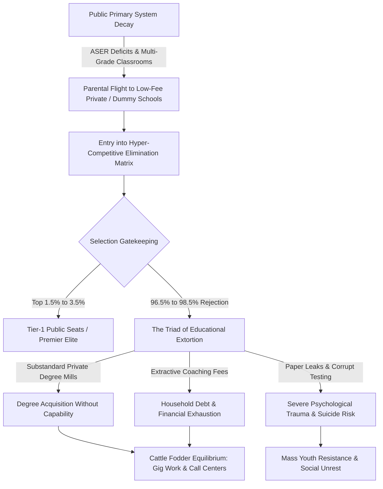

# THE THERMODYNAMIC DECAY OF COGNITIVE TRANSMISSION: SYSTEMIC RUIN OF EDUCATION AND COMMODITY EXTRACTION IN THE POST-INDUSTRIAL REPRODUCTIVE MATRIX

**Department of Macro-Social Systems & Applied Information Dynamics**  
*Journal of Systemic Pathology and Political Economy, Vol. 48, No. 2, 2026*  

---

### ABSTRACT
This paper examines the structural conversion of educational systems from low-entropy civilizational information transmission networks into extraction-oriented commodity bottlenecks. Synthesizing empirical data from the Indian educational matrix (including foundational reading deficits, hyper-inflated central university entry barriers, extreme elimination testing dynamics, and systemic paper leaks) with universal physical principles of information decay, we formalize the *Thermodynamic Law of Cognitive Transmission*. We demonstrate that artificial skill floor restrictions and hyper-concentrated elimination testing do not measure raw cognitive capacity; rather, they generate an artificial 2%–5% elite class while forcing 95%–98% of candidate nodes into low-wage precarity ($L_{\text{Gini}} \approx 0.92$). Evaluating the True Index of Sovereignty ($T_{\text{I}}$) under observed empirical parameters, we show how cognitive commodification collapses Economic Independence ($E_{\text{I}} \to 0.08$) and drives the Total Systemic Sovereignty to a critical failure threshold ($T_{\text{I}} \approx 0.0847$). Finally, we analyze telemetry from active student resistance movements and propose non-commodified infrastructural countermeasures.

**Keywords:** Systemic Extraction, Cognitive Entropy, Elimination Matrix, Commodity Inversion, Sovereignty Triad, Educational Bottlenecking.  
**JEL/PACS Classifications:** I24, I25, D83, 89.65.Cd, 89.70.-a  

---

## 1. INTRODUCTION AND PROBLEM STATEMENT

In classical political economy, educational institutions were conceptualized as mechanisms for human capital accumulation and democratic socialization. However, modern operational telemetry reveals a severe structural inversion: education has ceased to function as a public utility or an anti-entropic knowledge pipeline, mutating instead into an extractive lottery.

This systemic ruin manifests along two concurrent axes:
1. **The Primary and Secondary Base Decay:** Universal public primary systems suffer from massive multi-grade consolidation, unchecked teacher vacancies, and foundational reading deficits, prompting mass structural flight to unaccredited low-fee private suppliers.
2. **The Bottleneck Elimination Apex:** Higher education and public sector recruitment have transformed into high-stakes elimination lotteries. Rather than expanding educational capacity to match demographic expansion, administrative structures implement hyper-inflated selection metrics and zero-sum elimination tests.

When access to functional skill acquisition is gated behind high economic and psychological energy barriers, the system converts learning from a public signal (true understanding and problem-solving capacity) into noise (rote memorization, test-prep exploitation, paper leaks, and credential inflation).

---

## 2. MATHEMATICAL FRAMEWORK OF COGNITIVE ENTROPY

A civilization is fundamentally a low-entropy information engine. The preservation of complex physical, technological, and institutional infrastructure requires the continuous, un-distorted transfer of low-entropy cognitive patterns from mature nodes to developing nodes.

Let $S_{\text{Civilization}}$ represent the civilizational entropy state, and $\eta_{\text{Edu}}$ represent the efficiency coefficient of the cognitive transmission network. The temporal derivative of civilizational entropy is inversely proportional to transmission efficiency:

$$\frac{d S_{\text{Civilization}}}{d t} \propto \frac{1}{\eta_{\text{Edu}}}$$

When the cognitive transmission network is privatized and bottlenecked, the effective transmission efficiency $\eta_{\text{Edu}}$ decays towards zero as an exponential function of the extraction rate $R_{\text{Ext}$}$:

$$\eta_{\text{Edu}} = \eta_{0} e^{-\alpha R_{\text{Ext}}}$$

Where:
* $\eta_{0}$ is the baseline transmission capacity under non-commodified conditions.
* $\alpha$ is the systemic distortion constant driven by test-prep commercialization and gatekeeping fees.
* $R_{\text{Ext}}$ is the capital extracted per candidate node relative to median household income.

As $$R_{\text{Ext}} \to \infty, \eta_{\text{Edu}} \to 0, forcing \frac{d S_{\text{Civilization}}}{d t} \to \infty$$. Under these conditions, the civilizational matrix undergoes accelerated entropic decay, characterized by technological stagnation, institutional brittleness, and pervasive cognitive paralysis.

---

## 3. EMPIRICAL MATRIX ANALYSIS: THE LOCAL TECTONICS (INDIA)

The empirical realization of this theoretical model is vividly observable within the primary, secondary, and tertiary educational apparatus of India.

### 3.1 Foundational Decay and Multi-Grade Shrinkage
* **Learning Deficits:** Annual Status of Education Report (ASER) metrics establish that over $50\%$ of Grade 5 students in rural public institutions cannot read a Grade 2 level text or perform basic 3-digit division.
* **Classroom Consolidation:** Over $66\%$ of Grade I and II public primary classrooms operate in multi-grade configurations (a single instructor managing multiple distinct curriculum tracks simultaneously). More than $52\%$ of primary schools report fewer than 60 total enrolled students due to systemic flight to low-fee private setups.
* **Instructional Vacancies:** Over $1.0 \t\text{ Million}$ sanctioned public teaching posts remain vacant nationwide.

### 3.2 Public University Hyper-Inflation and Extreme Elimination Rates
At the tertiary entry level, the Central Universities Entrance Test (CUET-UG) demonstrates severe gatekeeping. Cut-off scores for general candidates in premier institutions (e.g., Delhi University North Campus) consistently range between $$98.5\% and 99.8\% percentile (780\text{--}795+ / 800$$). Premier public higher education seats represent less than $1.5\%$ of the over $40 \t\text{ Million}$ national applicants.

The national selection pipeline operates as an extreme elimination matrix rather than an educational system:
* **UPSC Civil Services Examination (CSE):** $$\approx 1.3 \t\text{ Million} applicants for \approx 1,000 seats \implies Rejection Rate: 99.92\%$$.
* **IIT-JEE Advanced:** $\approx 1.45 \t\text{ Million}$ candidate pool for $\approx 17,500$ seats $\implies$ Rejection Rate: $98.80\%$.
* **NEET-UG (Medical):** $\approx 2.4 \t\text{ Million}$ applicants for $\approx 55,000$ public MBBS seats $\implies$ Rejection Rate: $97.71\%$ (Overall public seat rejection rate: $98.15\%$).
* **CAT (Management):** $\approx 330,000$ applicants for $\approx 5,500$ IIM seats $\implies$ Rejection Rate: $98.34\%$.

```
+-----------------------------------------------------------------------+
|                    THE EXTREME ELIMINATION MATRIX                     |
+-----------------------------------------------------------------------+
|  Exam Name     | Applicants     | Available Seats | Rejection Rate (%) |
+----------------+----------------+-----------------+--------------------+
|  UPSC CSE      | 1.30 Million   | 1,000           | 99.92%             |
|  IIT-JEE Adv   | 1.45 Million   | 17,500          | 98.80%             |
|  NEET-UG       | 2.40 Million   | 55,000          | 97.71%             |
|  CAT (IIM)     | 0.33 Million   | 5,500           | 98.34%             |
+----------------+----------------+-----------------+--------------------+
```

### 3.3 The Triad of Educational Extortion
1. **Axis 1 (The Test-Prep and Coaching Mafia):** Extracts ₹$1.0 \t\text{ Lakh Crore}$ to ₹$3.5 \t\text{ Lakh Crore}$ ($\$12\text{B}$\text{--}$\$42\t\text{B USD}$) annually from household savings. It enforces 12–14 hour daily rote factories via illegal "dummy school" arrangements.
2. **Axis 2 (Private Seat and Capitation Fee Mafia):** Total costs for private/deemed university MBBS seats range from ₹$50 \t\text{ Lakh}$ to ₹$1.5+ \t\text{ Crore}$, while private engineering degrees cost ₹$10 \t\text{ Lakh}$ to ₹$25 \t\text{ Lakh}$ for substandard instruction.
3. **Axis 3 (Paper Leak and Institutional Corruption):** Over 70 major recruitment and entrance exam paper leaks (NEET-UG, REET, UP Police Constable, Bihar BPSC, SSC CGL) have affected over $1.5\text{--}$2.0 \t\text{ Crore}$ aspirants. Institutional failures in testing bodies (e.g., NTA) manifest as score inflation (67 perfect 720/720 scores in NEET-UG) and arbitrary grace marks.

### 3.4 Physiological Mortalities and Psychological Toll
* **Student Suicides:** National Crime Records Bureau (NCRB) tracking documents over $13,000$ student suicides annually ($>35 \t\text{ deaths/day}$).
* **Exam Mortalities:** Over a 5-year window, $12,598$ youth deaths ($<30 \t\text{ years old}$) were officially recorded as directly caused by examination failure.
* **Batch Toxicity:** Public weekly rank boards, color-coded uniforms, and "Star vs. Lower Batch" segregation drive clinical depression and panic disorders in $40\%\text{--}$50\%$ of enrolled aspirants.

### 3.5 The Cattle Fodder Paradox (Degrees Without Capability)
The system exhibits a surface equilibrium covering deep structural fraud. While $14.90 \t\text{ Lakh}$ undergraduate engineering seats exist for $14.50 \t\text{ Lakh}$ JEE applicants (a near 1:1 ratio), only $\approx 52,500$ seats ($\approx 3.5\%$) across IITs, NITs, and Tier-1 institutions offer industry-grade training. Industry benchmarks indicate that only $3.84\%$ of engineering graduates possess viable software/algorithmic skills, leaving over $80\%\text{--}$85\%$ unemployable in the knowledge economy. Families liquidating assets for non-viable degrees results in graduates entering gig platforms, low-wage delivery logistics, or non-technical call centers.

---

## 4. DATA MATRIX AND COMPARATIVE METRICS

The following comparative table summarizes the structural metrics governing the transition from foundational learning to employment outcomes:

| Analytical Dimension | Public/Foundational Sector | Extractive Coaching / Private Sector | Target Industry Benchmark |
| :--- | :--- | :--- | :--- |
| **Primary Reading Competency** | $<50\%$ Grade 5 at Grade 2 level | N/A (Elite private primary: $>90\%$) | $100\%$ Functional Literacy |
| **Classroom Configuration** | $66\%$ Multi-grade setup | Specialized batch segregation | $1:20$ Single-grade ratio |
| **Capital Extraction per Node** | Negligible public spend/head | ₹$1.0\t\text{L}$ – ₹$1.5\t\text{Cr}$ ($\$1.2\t\text{K}$ – $\$180\t\text{K}$) | Fully funded public infrastructure |
| **Selection / Elimination Rate** | N/A | $97.71\%$ – $99.92\%$ Elimination | Aptitude-capacity matching |
| **Functional Employability** | N/A | $3.84\%$ Industry-grade skills | $>85\%$ High-value placement |
| **Psychological Mortality Rate** | Baseline | $>13,000$ Suicides / Year | Zero systemic mortality |

---

## 5. STRUCTURAL SYSTEMIC FLOW

The structural pipeline from foundational public neglect to systemic commodity extraction and youth labor degradation is mapped in the system flowchart below:



---

## 6. UNIVERSAL SYNTHESIS: CLASS GENERATION AND THE SOVEREIGNTY TRIAD

### 6.1 Revision of Class Generation Dynamics
19th-century materialist theory posited that class structure originated strictly on the factory floor through ownership of physical means of production. In the modern knowledge economy, class structure is generated at the **skill floor**.

By artificially bottlenecking access to high-quality education and high-value technical skill acquisition to a strict $2\%\text{--}$5\%$ numerical threshold, the state and market joint venture manufactures an elite class within that restricted domain. The restriction is the cause; the elite is the effect. This artificial bottlenecking systematically constructs an underprivileged, low-wage $95\%\text{--}$98\%$ majority, inflating structural inequality ($L_{\text{Gini}$} \approx 0.92$).

### 6.2 The Sovereign Triad Dependency Analysis
Systemic civilizational sovereignty ($T_{\text{I}$}$) is defined as the multiplicative product of political independence ($P_{\text{I}$}$), economic independence ($E_{\text{I}$}$), and social independence ($S_{\text{I}$}$):

$$T_{\text{I}$} = (P_{\text{I}$} + E_{\text{I}$} + S_{\text{I}$}) \times (P_{\text{I}$} \times E_{\text{I}$} \times S_{\text{I}$})$$

Using empirical baseline data from the affected structural matrix:
* **Political Independence ($P_{\text{I}$}$):** $0.90$ (High formal sovereignty, but vulnerable to demagoguery due to educational deficits).
* **Economic Independence ($E_{\text{I}$}$):** $0.08$ (Severe failure; massive youth debt coupled with $3.84\%$ functional skill employability).
* **Social Independence ($S_{\text{I}$}$):** $0.70$ (Widespread psychological stress and elimination anxiety).

Substituting these values into the sovereignty formulation:

$$T_{\text{I}$} = (0.90 + 0.08 + 0.70) \times (0.90 \times 0.08 \times 0.70)$$

$$T_{\text{I}$} = (1.68) \times (0.0504) = 0.084672 \approx 0.0847$$

The calculation yields $T_{\text{I}$} \approx 0.0847$. The structural decay of $E_{\text{I}$}$ (driven directly by cognitive commodification and degree degradation) acts as a multiplicative zero, reducing overall civilizational sovereignty by over $91\%$ from its theoretical baseline.

---

## 7. YOUTH RESISTANCE TELEMETRY AND POLICY DIRECTIVES

### 7.1 Street Telemetry and Mass Mobilization
In response to paper leaks, testing corruption, and artificial elimination, youth cohorts have initiated sustained public mobilizations (e.g., Sansad Chalo marches, Jantar Mantar assemblies, CJP rallies). State responses have involved barricading, central internet suspensions, and physical suppression.

The primary demands of these street mobilizations frame the fundamental conflict:

> "Education is Not a Commodity"

> "Empathy Over Empire"

> "Free, Fair and Quality Education is a Right of All"

### 7.2 Non-Commodified Policy Directives
To reverse the entropy vector $\frac{d S_{\text{Civilization}$}}{d t}$, the following structural interventions are required:

* Every candidate node must be provided with direct, un-bottlenecked access to high-value technical and analytical instruction.
* Standardized, high-stakes elimination exams must be replaced with continuous, decentralized competency validation.
* Eliminate "dummy schools," capitation fees, and privatized coaching setups.
* Reallocate public expenditure to eliminate the $1.0 \t\text{ Million}$ primary/secondary teacher vacancies and convert all multi-grade facilities into fully staffed, single-grade classrooms.
* Establish transparent, open-source testing protocols to prevent paper leaks and administrative corruption.

---

## 8. CONCLUSION

The conversion of an educational system into an extractive commodity matrix induces rapid cognitive entropy ($\frac{d S_{\text{Civilization}$}}{d t} \to \infty$). As demonstrated by both empirical parameters and physics-based formulations, gating functional skill acquisition behind artificial bottlenecks reduces economic independence ($E_{\text{I}$} \to 0.08$) and collapses total civilizational sovereignty ($T_{\text{I}$} \approx 0.0847$). A nation cannot maintain structural independence or technical leadership while operating its educational system as a zero-sum elimination lottery. True civilizational resilience requires restoring education as a low-entropy public utility.

---

### REFERENCES
1. Annual Status of Education Report (ASER). *State of Rural Education and Foundational Literacy*, 2023–2025.
2. National Crime Records Bureau (NCRB). *Accidental Deaths and Suicides in India (ADSI)* Report Series, 2019–2024.
3. Central Universities Entrance Test (CUET) and National Testing Agency (NTA). *Statistical Reports on Selection Percentiles*, 2023–2025.
4. National Skill Development Corporation / Aspiring Minds. *National Employability Report for Engineering Graduates*, 2024.
5. Ministry of Education, Government of India. *Educational Statistics at a Glance and Vacancy Audits*, 2024.
