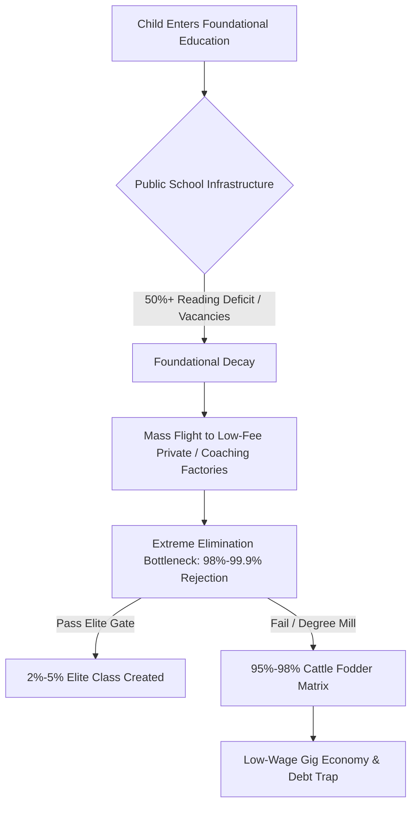
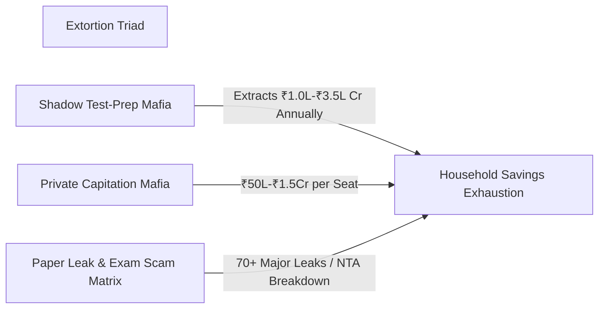
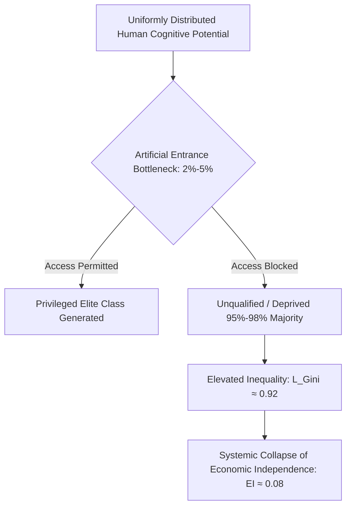

# THE ANATOMY OF SYSTEMIC EDUCATIONAL RUIN AND COMMODITY EXTRACTION

---

## 1. EXECUTIVE SUMMARY & THE EVERYDAY REALITY

To the average family, education represents the single most important path toward upward mobility, security, and personal dignity. Parents sacrifice ancestral land, take high-interest loans, and exhaust lifetime savings under a simple promise: hard work and merit will secure a better future for their children. 

However, empirical data and universal physical principles show that the modern educational framework no longer operates as an engine of mobility. Instead, it functions as a highly extortionate bottleneck. By artificially choking supply at the top and commodifying learning at the bottom, the system converts fundamental human potential into financial extraction, creating widespread cognitive decay, mental trauma, and structural unemployment.



---

## 2. FOUNDATIONAL DECAY AND PUBLIC UNIVERSITY BOTTLENECK

The crisis begins at the primary level, where public infrastructure is systematically underfunded, creating a cascading failure that forces families into private extraction markets.

### Foundational Primary & Secondary Deficits
* **Learning Deficits (ASER Telemetry):** Over $50\%$ of Grade 5 students in rural public primary schools are unable to read a Grade 2 textbook or solve basic 3-digit division problems.
* **Multigrade Classrooms:** $66\%$ of Grade I and II public primary classrooms operate on multigrade arrangements, where a single teacher simultaneously instructs multiple age groups.
* **Primary School Shrinkage:** Over $52\%$ of public primary schools now enroll fewer than $60$ total students due to mass parental flight toward low-fee private institutions.
* **Teacher Shortages:** More than $1.0 \times 10^6$ ($10$ Lakh+) sanctioned public primary and secondary teaching positions remain unfilled nationwide.

### Public University Gatekeeping
When students reach higher education, they encounter extreme artificial scarcity. Central University entrance metrics (such as CUET-UG) require general candidates seeking high-demand courses at premier public institutions (e.g., DU North Campus colleges like SRCC, Hindu, and Hansraj) to score between $98.5\%$ and $99.8\%$ percentile ($780\t$	ext{ to }$795+ / 800$).

This hyper-inflation is not driven by higher student intelligence, but by a severe structural shortage: premier public seats represent less than $1.5\%$ of the $4.0 \times 10^7$ ($40$ Million+) annual applicant pool.

---

## 3. THE EXTREME ELIMINATION MATRIX

Because public capacity is kept small, entrance examinations do not evaluate aptitude—they execute numerical elimination.

| Examination / Gateway | Applicant Pool | Available Seats | Rejection Rate | Systemic Output |
| :--- | :--- | :--- | :--- | :--- |
| **UPSC Civil Services (CSE)** | $\approx 1.3 \times 10^6$ ($13.0$ Lakh) | $\approx 1,000$ | **$99.92\%$** | Administrative Gatekeeping |
| **IIT-JEE Advanced** | $\approx 1.45 \times 10^6$ ($14.5$ Lakh) | $\approx 17,500$ | **$98.80\%$** | Technological Gatekeeping |
| **NEET-UG (Medical)** | $\approx 2.4 \times 10^6$ ($24.0$ Lakh) | $\approx 55,000$ (Govt MBBS) | **$97.71\%$** | Healthcare Gatekeeping |
| **CAT (IIM Management)** | $\approx 3.3 \times 10^5$ ($3.3$ Lakh) | $\approx 5,500$ | **$98.34\%$** | Managerial Gatekeeping |

---

## 4. THE TRIAD OF EDUCATIONAL EXTORTION & INTEGRITY COLLAPSE

The gap between public infrastructure deficits and numerical elimination creates an aggressive shadow economy that monetizes desperation.



### 1. Test-Prep & Coaching Complex
The private coaching network extracts between ₹$1.0 \times 10^5$ Crore and ₹$3.5 \times 10^5$ Crore ($\$12\t\text{ Billion}$ to $\$42\t\text{ Billion USD}$) annually from household savings. To maximize throughput, these institutions run $12\t$	ext{ to }$14\t\text{ hour}$ rote factories utilizing "dummy school" arrangements that strip students of real-world socialization and conceptual comprehension.

### 2. Private Seat & Capitation Extraction
When elimination strikes, private institutions capture the remaining pool. Medical seats in private or deemed universities command capitation and tuition fees between ₹$50\t\text{ Lakh}$ and ₹$1.5+\t\text{ Crore}$. Private engineering and management degrees cost between ₹$10\t\text{ Lakh}$ and ₹$25\t\text{ Lakh}$, providing substandard instruction and outdated curricula.

### 3. Exam Integrity Breakdown
* **Paper Leaks:** Over $70$ major competitive and recruitment examination leaks have been documented across $15+$ states (NEET-UG, REET, UP Police Constable, Bihar BPSC, SSC CGL), directly compromising over $1.5 \times 10^7 \t$	ext{ to }$ 2.0 \times 10^7$ aspirants.
* **Institutional Failures:** Dark-channel paper sales, score inflation ($67$ perfect scores of $720/720$ in NEET-UG), and unannounced grace marks have undermined national testing agencies. Legislative patches like the *Public Examinations (Prevention of Unfair Means) Act, 2024* fail to address the core incentive structures driving the coaching-state nexus.

---

## 5. HUMAN COST AND MENTAL TOLL

The human damage caused by this elimination mechanism is reflected in national health and mortality statistics:

* **Annual Student Suicides:** National Crime Records Bureau (NCRB) data confirms over $13,000$ student suicides per year—translating to over $35$ deaths per day, or $1$ student death every $40\t\text{ minutes}$.
* **Exam Failure Mortalities:** $12,598$ youth deaths ($<30\t\text{ years old}$) have been officially recorded as direct consequences of examination failure over a $5\t\text{ year}$ tracking period.
* **Coaching Batch Segregation:** Systemic practices such as public weekly rank boards, color-coded uniforms based on test scores, and separation into "Star vs. Lower Batches" generate clinical depression, panic disorders, and early-onset hypertension in $40\%\t$	ext{ to }$50\%$ of enrolled aspirants.

---

## 6. THE CATTLE FODDER PARADOX (THE FAKE EQUILIBRIUM)

To maintain social stability, the educational market provides an illusion of universal access through non-viable higher education seats.

```
       [ SURFACE RATIO: 1 : 1 ]
       14.90 Lakh Approved UG Seats  <--->  14.50 Lakh JEE Registered Applicants
                                  |
                                  v
       [ REAL QUALITY GAP ]
       +-------------------------------------------------------+
       | Tier-1 Viable Quality Seats: 52,500 (~3.5%)          |
       +-------------------------------------------------------+
       | Employable Software / Algorithmic Skills: 3.84%       |
       +-------------------------------------------------------+
       | Unemployable / Degree Mill Output: >80% - 85%         |
       +-------------------------------------------------------+
                                  |
                                  v
       [ RESULT: FORCED DOWNWARD MOBILITY ]
       Gig Work / Delivery Drivers / Non-Technical Call Centers
```

1. **The Paper Illusion:** Approved undergraduate engineering seats ($14.90 \t\text{ Lakh}$) roughly equal total JEE applicants ($14.50 \t\text{ Lakh}$). On paper, every candidate has a seat.
2. **The Quality Rejection Reality:** Only $\approx 52,500$ seats ($\approx 3.5\%$) across IITs, NITs, and Tier-1 public colleges provide industry-standard education.
3. **Employability Deficit:** Only $3.84\%$ of nationwide engineering graduates possess industry-grade software/algorithmic skills. Over $80\%\t$	ext{ to }$85\%$ remain unemployable in the knowledge economy.
4. **Degree Mill Funnel:** $96.5\%$ of higher education seats function as commercial degree mills. Families exhaust ancestral assets or take high-interest loans, only for graduates to enter low-wage gig work, food delivery, or non-technical call centers.

---

## 7. UNIVERSAL PHYSICS OF COGNITIVE TRANSMISSION

From a systemic perspective, education is not a service or a commercial market. It is the primary anti-entropic information transmission mechanism of a civilization.

### Entropy and Cognitive Transmission
Physical systems naturally decay toward maximum entropy (disorder, $S \to \infty$). To maintain technical, organizational, and social infrastructure, low-entropy cognitive patterns (knowledge, critical reasoning, technical competence) must be transferred efficiently from mature nodes to developing nodes:

$$\frac{dS_{\t$	ext{Civilization}$}}{dt} \propto \frac{1}{\eta_{\t$	ext{Edu}$}}$$

Where $\eta_{\t$	ext{Edu}$}$ represents the overall cognitive transmission efficiency of the educational network. When education is converted into an extortionate bottleneck, $\eta_{\t$	ext{Edu}$} \to 0$, causing civilizational entropy ($\frac{dS_{\t$	ext{Civilization}$}}{dt}$) to surge.

### The Skill Floor as the Class Generator
Raw intelligence and problem-solving capability are distributed uniformly across the human population matrix. Genius is not restricted to high-income postcodes or elite lineages.

When high-quality skill acquisition is constrained to a narrow numerical band ($2\%\t$	ext{ to }$5\%$), this artificial bottleneck generates an elite class. The restriction is the cause; the elite is the effect.



By bottlenecking the skill floor, the system systematically manufactures a low-wage, under-skilled $95\%\t$	ext{ to }$98\%$ majority, driving structural economic inequality ($L_{\t$	ext{Gini}$} \approx 0.92$).

### Signal vs. Noise (The Commodity Inversion)
When learning is privatized, its objective flips from *capability maximization* to *gatekeeping extraction*:

* **Signal Transmission:** True understanding, physical insight, algorithmic problem solving, and original thought.
* **Noise Generation:** Rote memorization, test-gaming techniques, hyper-competitive elimination drills, and unaccredited credentials.

---

## 8. SOVEREIGNTY TRIAD FAILURE

A society's stability depends on the Sovereignty Triad Index ($\t\text{TI}$), calculated as:

$$\t$	ext{TI}$ = (\t$	ext{PI}$ + \t$	ext{EI}$ + \t$	ext{SI}$) \times (\t$	ext{PI}$ \times \t$	ext{EI}$ \times \t$	ext{SI}$)$$

Where:
* $\t\text{PI}$ = Political Independence Baseline ($0.90$)
* $\t\text{EI}$ = Economic Independence Factor ($0.08$, reflecting mass skill deficits and high youth debt)
* $\t\text{SI}$ = Social Independence Metric ($0.70$, damaged by hyper-competitive elimination and mental trauma)

### Numerical Index Evaluation:

$$\t$	ext{TI}$ = (0.90 + 0.08 + 0.70) \times (0.90 \times 0.08 \times 0.70)$$

$$\t$	ext{TI}$ = (1.68) \times (0.0504) = 0.084672$$

An index value of $\t$	ext{TI}$ \approx 0.0847$ demonstrates that converting education into a market commodity weakens economic self-reliance, leaving the overall population vulnerable to technological dependency and systemic instability.

---

## 9. YOUTH RESISTANCE & STREET TELEMETRY

In response to paper leaks, testing agency failures, and ongoing educational extraction, student movements have organized public demonstrations, including the *Sansad Chalo* march, Jantar Mantar assemblies, and nationwide mobilization.

Despite barricades, internet suspensions, and physical crackdowns, youth placards summarize the structural demand:

> "Education is Not a Commodity"

> "Empathy Over Empire"

> "Free, Fair and Quality Education is a Right of All"

---

## 10. SYSTEMIC RECOVERY MATRIX

To restore the educational pipeline from a profit-driven bottleneck back into an anti-entropic transmission network, the following structural adjustments are required:

1. **Elimination of the Shadow Coaching Market:** Re-integrate university admission criteria with secondary school curricula, rendering third-party test-prep factories redundant.
2. **Expansion of Tier-1 Public Capacity:** Expand premier public higher education capacity by a factor of $10\times$ to remove artificial scarcity.
3. **Primary Infrastructure Reinvestment:** Fill the $1.0 \times 10^6+$ public teaching vacancies and consolidate multigrade setups into fully-staffed regional public learning centers.
4. **National Audit and Transparency Standards:** Implement open-source, cryptographically verified testing workflows for all national examinations to prevent paper leaks and administrative corruption.