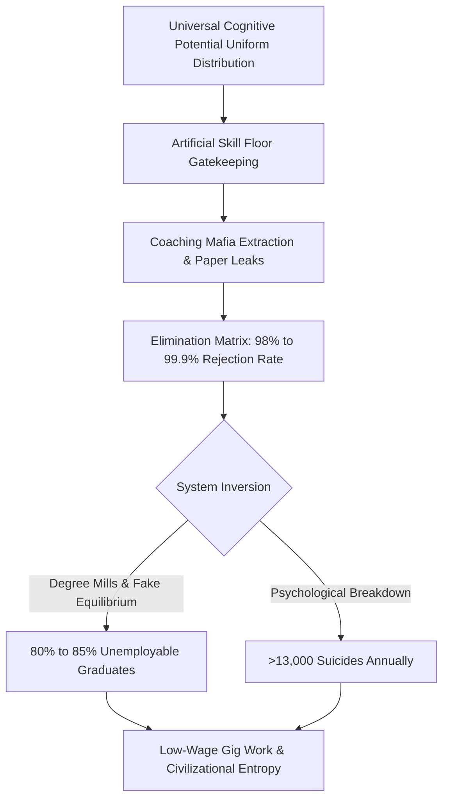

# SYSTEMIC RUIN OF EDUCATION AND COMMODITY EXTRACTION

---

### 1. EXECUTIVE OVERVIEW & THERMODYNAMIC FOUNDATION

Education is fundamentally the primary anti-entropic information transmission mechanism of a civilization, rather than a privatized business sector or administrative service. Physical systems naturally decay toward maximum thermodynamic entropy ($S \to \infty$). To maintain technical, physical, and civilizational infrastructure, low-entropy cognitive patterns must be transferred from mature nodes to developing nodes without structural friction.

$$\frac{dS_{\t$	ext{Civilization}$}}{dt} \propto \frac{1}{\eta_{\t$	ext{Edu}$}}$$

When education is converted into an extortionate commodity, signal transmission (true understanding, algorithmic capacity, and critical capability) collapses into noise generation (rote memorization, paper leaks, credential inflation, and elimination lotteries). Artificial energy barriers—such as exorbitant capitation fees and hyper-concentrated test lotteries—clamp down on over 95% of the population matrix, inducing systemic cognitive paralysis and accelerating civilizational entropy.

---

### 2. LOCAL EMPIRICAL TELEMETRY: FOUNDATIONAL DECAY & ELIMINATION MATRIX

The conversion of the learning gateway into an extraction apparatus produces extreme structural failures across foundational, secondary, and competitive levels:

* **Foundational & Primary Decay:** ASER data shows >50% of Grade 5 students in rural public schools cannot read Grade 2 text or perform basic 3-digit division. Over 66% of Grade I & II public primary classrooms run on multigrade setups, while >52% of primary schools have <60 total enrolled students due to mass flight to low-fee private schools. Over 10 Lakh sanctioned teacher posts remain vacant nationwide.
* **Public Capacity Gatekeeping:** Central University entrance (CUET UG) cut-offs reach 98.5% to 99.8% percentile (780–795+/800) for premier colleges (DU SRCC, Hindu, Hansraj, St. Stephen's), where public seats represent less than 1.5% of the 40 Million+ applicant pool.
* **The Elimination Bottleneck:** Hyper-competitive lotteries operate as brutal elimination matrices rather than selection systems:
  * **UPSC CSE:** ~13.0 Lakh Applicants $\to$ ~1,000 Seats (Rejection Rate: 99.92%)
  * **IIT-JEE Advanced:** ~14.5 Lakh Candidates $\to$ ~17,500 IIT Seats (Rejection Rate: 98.80%)
  * **NEET-UG Medical:** ~24.0 Lakh Applicants $\to$ ~55,000 Govt MBBS Seats (Rejection Rate: 97.71%)
  * **CAT IIM:** ~3.3 Lakh Applicants $\to$ ~5,500 Seats (Rejection Rate: 98.34%)
* **Extortion Triad:** The test-prep/coaching mafia extracts ₹1.0 Lakh Crore to ₹3.5 Lakh Crore ($12B–$42B USD) annually from household savings, operating "dummy schools" with 12–14 hour rote factories. Private/deemed university MBBS seats range from ₹50 Lakh to ₹1.5+ Crore, dumping debt onto families for substandard instruction.
* **Human and Integrity Toll:** NCRB data logs >13,000 student suicides annually (>35 deaths/day). Over 70+ major paper leaks across 15+ states (NEET-UG, REET, UP Police Constable, Bihar BPSC, SSC CGL) have disrupted >1.5 Crore to 2.0 Crore aspirants.

---

### 3. SYSTEM MECHANICS & COMMODITY INVERSION

---

### 4. THE CLASS GENERATOR & SOVEREIGNTY TRIAD COLLAPSE

#### The Class Generator Mechanism
By restricting access to high-quality education and functional skill acquisition to a strict 2%–5% numerical threshold, the system artificially generates an elite class. The bottlenecking of the skill floor manufactures an underprivileged, low-wage 95%–98% majority, driving upstream economic inequality ($L_{\t$	ext{Gini}$} \approx 0.92$).

#### Sovereignty Triad Coupling
Systemic ruin in education collapses the Total Sovereignty Index ($TI$):

$$TI = (PI + EI + SI) \times (PI \times EI \times SI)$$

Given localized parameters:
* Political Independence ($PI$) = $0.90$
* Economic Independence ($EI$) = $0.08$ (driven by credential debt and zero skill floor)
* Social Independence ($SI$) = $0.70$ (eroded by elimination toxicity and despair)

$$TI = (0.90 + 0.08 + 0.70) \times (0.90 \times 0.08 \times 0.70) = 1.68 \times 0.0504 = 0.084672$$

A collapse in Economic Independence ($EI \to 0.08$) drags down total national sovereignty ($TI \approx 0.0847$), trapping the republic in technological dependency and structural weakness.

---

### 5. COMPARATIVE MATRIX DATA & RESISTANCE TELEMETRY

| Metric Vector | Surface / Official Claim | Empirical / Universal Reality |
| :--- | :--- | :--- |
| **Engineering Seat Supply** | 14.90 Lakh Seats vs 14.50 Lakh Applicants (1:1 Ratio) | Only ~52,500 (~3.5%) seats offer industry-grade quality; >80% to 85% remain unemployable. |
| **Employability Skill Floor** | Massive degree-holder expansion | Only 3.84% of engineering graduates possess software/algorithmic skills. |
| **Exam Integrity** | Standardized testing via central agencies | Over 70+ paper leaks impacting >1.5 Crore aspirants; dark-channel score inflations. |
| **Resource Allocation** | Meritocratic social mobility | Household extraction of ₹1.0L–₹3.5L Crore by coaching mafias; capitation fees up to ₹1.5 Cr. |
| **Psychological Cost** | "Healthy competition" | >13,000 student suicides/year; 12,598 exam-failure deaths in 5-year window. |

#### Youth Street Telemetry & Resistance Slogans
Student mobilizations (Sansad Chalo march, Jantar Mantar rallies, CJP mobilization) reject the commodity model despite state suppression, barricading, and detentions.

> "Education is Not a Commodity"

> "Empathy Over Empire"

> "Free, Fair and Quality Education is a Right of All"