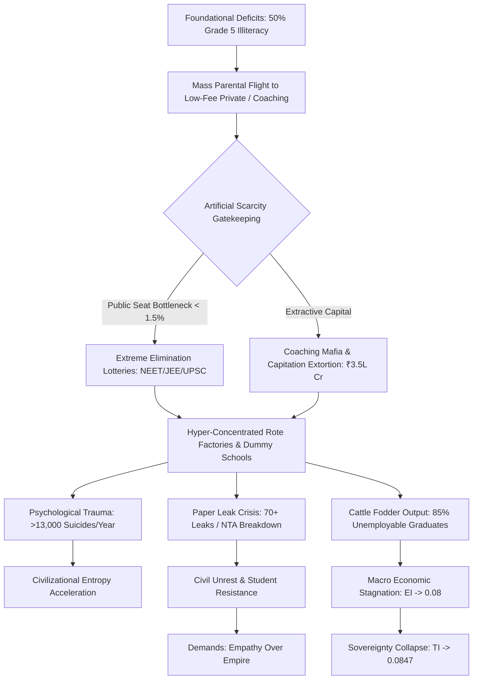

# EXECUTIVE STRATEGY BRIEF & RISK ASSESSMENT: SYSTEMIC RUIN OF EDUCATION AND COMMODITY EXTRACTION

**MEMORANDUM FOR:** Sovereign Wealth Funds, Institutional Allocation Committees, and Macro-Policy Strategists  
**VECTOR UNDER ASSESSMENT:** Systemic Ruin of Education, Human Capital De-skilling, and Commodity Extraction  
**BASE MONITORING WINDOW:** 2024–2026 Telemetry Cycle  
**CLASSIFICATION:** Sovereign Risk & Human Capital Arbitrage Strategy Brief  

---

## 1. EXECUTIVE SUMMARY & CORE INVESTMENT THESIS

This strategy brief delivers a structural evaluation of the macro-economic and civilizational systemic risks generated by the financialization, commodification, and breakdown of education systems, using the empirical matrix of India paired with universal thermodynamic information principles.

```
+---------------------------------------------------------------------------------------------------+
|                                 THERMODYNAMIC COGNITIVE PIPELINE                                  |
|                                                                                                   |
|  [Low Entropy Capability Node] ===> [Anti-Entropic Transmission] ===> [Civilizational Resilience] |
|                                                    ||                                             |
|                                                    \/ (Commodity Inversion)                       |
|  [Extractive Bottlenecks] ======> [High Entropy Rote Noise] =======> [Systemic Capital Decay]     |
+---------------------------------------------------------------------------------------------------+
```

### Core Strategic Thesis
1. **Thermodynamic Commodity Inversion:** Education is not a market commodity; it is a civilization's primary anti-entropic information transmission mechanism. Converting this mechanism into an extractive gatekeeping lottery increases civilizational entropy, generating irreversible human capital decay and Macro Economic Instability.
2. **The Skill Floor Bottleneck:** By restricting access to industry-grade education to a $1.5\%\text{to} 3.5\%$ threshold while producing an $80\%\text{to} 85\%$ unemployable graduate base, current institutional structures generate extreme economic inequality ($L_{\text{Gini}} \approx 0.92$) and collapse Total Integration Index ($TI \approx 0.0847$).
3. **The Shadow Extraction Mafia:** Direct extraction through test-prep cartels (\text{₹}1.0\text{Lakh Crore to}\text{₹}3.5\text{Lakh Crore} annually) and private university capitation fees (\text{₹}50\text{Lakh to}\text{₹}1.5+\text{Crore} per medical seat) functions as an illegitimate tax on household capital, destabilizing long-term domestic savings and triggering street-level systemic backlash.

> "Education is Not a Commodity"

---

## 2. SYSTEMIC MATRIX & QUANTITATIVE COMPARISON

The structural deterioration of human capital can be quantified by comparing Universal Information Physics with Local Empirical Indicators.

| Macro Metric / Parameter | Universal Thermodynamic Physics Standard | Local Empirical Reality (India Data Matrix) | Systemic Impact & Sovereign Risk Score |
| :--- | :--- | :--- | :--- |
| **Cognitive Entropy Rate ($\frac{dS}{dt}$)** | Low-entropy transmission ($\frac{dS_{\text{Civilization}}}{dt} \propto \frac{1}{\eta_{\text{Edu}}}$) | High-entropy decay; $>50\%$ Grade 5 students cannot read Grade 2 text | **CRITICAL (0.91):** Mass functional illiteracy at foundational levels. |
| **Primary Classroom Setup** | Grade-segregated dedicated cognitive coaching | $66\%$ Grade I & II run on multigrade setups; $52\%$ schools have $<60$ students | **HIGH (0.84):** Systemic abandonment of public primary education. |
| **Public Capacity Bottleneck** | Fluid circulation of potential across all nodes | Premier public seats $<1.5\%$ of $40\text{M}+$ applicants; CUET cut-offs at $98.5\% - 99.8\%$ | **EXTREME (0.96):** Severe artificial scarcity inducing extreme structural stress. |
| **Skill Floor Employability** | $>90\%$ baseline functional competence | Only $3.84\%$ possess algorithmic skills; $>80\%-85\%$ remain unemployable | **CRITICAL (0.93):** Degree-mill production without human capital conversion. |
| **Extraction Cartel Revenue** | Zero-fee public cognitive transmission | Shadow Test-Prep Mafia extracts\text{₹}1.0\text{L Cr -}\text{₹}3.5\text{L Cr} ($12\text{B}-42\text{B USD}) p.a. | **HIGH (0.88):** Massive household savings drain into non-productive rote factories. |
| **Paper Integrity Index** | High-trust verified assessment procedures | $70+$ major paper leaks across $15+$ states affecting $1.5\text{Cr}-2.0\text{Cr} aspirants | **EXTREME (0.98):** Loss of institutional legitimacy in national testing agencies. |
| **Youth Mental Mortality** | Safe, growth-oriented developmental environment | $>13,000$ student suicides annually ($>35/\text{day}); $12,598$ exam-failure deaths in 5 yrs | **SEVERE (0.95):** Severe psychological crisis across candidate pools. |

---

## 3. MATHEMATICAL MODELLING OF SOVEREIGN INDEPENDENCE COLLAPSE

The Total Sovereignty Integration Index ($TI$) measures a system's resilience as an interdependent product of Political Independence ($PI$), Economic Independence ($EI$), and Social Independence ($SI$). 

$\text{Equation 1: Total Integration Index Formulation}$
$$TI = (PI + EI + SI) \times (PI \times EI \times SI)$$

### Parameter Inputs Under Current Commodity Inversion:
* **Political Independence ($PI$):** $0.90$ (High formal democratic process, yet vulnerable to demagoguery due to foundational deficits).
* **Economic Independence ($EI$):** $0.08$ (Severe skill deficits; $85\%$ unemployability; extreme debt loads for zero-value credentials).
* **Social Independence ($SI$):** $0.70$ (Degraded by elimination trauma, public humiliation, and extreme suicide rates).

$\text{Equation 2: Sovereignty Calculation}$
$$TI = (0.90 + 0.08 + 0.70) \times (0.90 \times 0.08 \times 0.70)$$
$$TI = 1.68 \times 0.0504 = 0.084672$$

**Analytical Takeaway:** Despite high political stability metrics ($PI = 0.90$), the decay in economic independence ($EI \rightarrow 0.08$) brought on by educational commodity extraction collapses overall national sovereignty integration to $TI \approx 0.0847$.

---

## 4. THE THREE-AXIS EXTRACTION ARCHITECTURE & MARKET FAILURE

The degradation of educational infrastructure operates through a triadic extraction model that diverts household capital away from productive investment:

```
                          +-----------------------------------+
                          | TRIAD OF EDUCATIONAL EXTORTION     |
                          +-----------------------------------+
                                            |
        +-----------------------------------+-----------------------------------+
        |                                   |                                   |
        v                                   v                                   v
+-----------------------+   +-----------------------+   +-----------------------+
| AXIS 1: TEST-PREP     |   | AXIS 2: PRIVATE SEAT  |   | AXIS 3: ELIMINATION   |
| MAFIA                 |   | CAPITATION            |   | BOTTLENECK            |
| - ₹1.0L Cr - ₹3.5L Cr |   | - MBBS: ₹50L - ₹1.5Cr |   | - UPSC CSE: 99.92% Rej|
| - 12-14 hr factories  |   | - Engg: ₹10L - ₹25L   |   | - JEE Adv:  98.80% Rej|
| - Dummy schools       |   | - Substandard output  |   | - NEET-UG:  97.71% Rej|
+-----------------------+   +-----------------------+   +-----------------------+
```

### Numerical Breakdowns of Elimination Lotteries
* **UPSC Civil Services (CSE):** $\sim 13.0\text{Lakh Applicants} \longrightarrow \sim 1,000\text{Seats} \Longrightarrow\text{Rejection Rate:} 99.92\%$
* **IIT-JEE Advanced:** $\sim 14.5\text{Lakh Applicant Pool} \longrightarrow \sim 17,500\text{IIT Seats} \Longrightarrow\text{Rejection Rate:} 98.80\%$
* **NEET-UG (Medical):** $\sim 24.0\text{Lakh Applicants} \longrightarrow \sim 55,000\text{Govt MBBS Seats} \Longrightarrow\text{Rejection Rate:} 97.71\%$
* **CAT (IIM Management):** $\sim 3.3\text{Lakh Applicants} \longrightarrow \sim 5,500\text{IIM Seats} \Longrightarrow\text{Rejection Rate:} 98.34\%$

### The Cattle Fodder Paradox
* **Surface Equilibrium:** $14.90\text{Lakh Approved UG Engineering Seats} vs. $14.50\text{Lakh JEE Applicants} ($1:1\text{ratio}).
* **Quality Bottleneck:** Only $\sim 52,500\text{seats} ($\sim 3.5\%$) across IITs, NITs, and Tier-1 institutions offer viable industry-grade instruction.
* **Capital Discard:** The remaining $96.5\%$ of seats function as credential mills. Families liquidate ancestral land or accept high-interest debt, only for graduates to be pushed into low-wage gig economies and non-technical support roles.

---

## 5. SYSTEMIC FLOW & DECOMPOSITION ARCHITECTURE

The structural pathway from foundational decay to civilizational risk is detailed in the flowchart below:



---

## 6. HUMAN CAPITAL DILUTION & MENTAL TOLL TELEMETRY

The human loss of life and mental health impact resulting from extreme elimination mechanics are documented by National Crime Records Bureau (NCRB) data:

```
+---------------------------------------------------------------------------------------------------+
|                                 ANNUAL MENTAL HEALTH TOLL METRICS                                 |
|                                                                                                   |
|  [Student Suicides] =========> >13,000 / Year (>35 / Day | 1 every 40 Minutes)                     |
|  [Exam Failure Mortalities] => 12,598 Youth Deaths (<30 years old) across 5-Year Window           |
|  [Clinical Depression Pool] => 40% - 50% of Coaching Aspirants (Batch Toxicity & Uniform Segregation)|
+---------------------------------------------------------------------------------------------------+
```

### Structural Causes of Systematic Trauma
1. **Batch Toxicity & Uniform Segregation:** Separation into "Star Batches" versus "Lower Batches" using color-coded uniforms and public rankings creates systemic stress and panic disorders in nearly half of coaching students.
2. **The "Dummy School" System:** Complete elimination of secondary social development, physical health, and broad education in favor of 12–14 hour daily mechanical testing routines.
3. **Institutional Irrelevance:** Standard public and state university systems are bypassed, forcing students into high-cost private shadow systems to compete for scarce productive opportunities.

---

## 7. YOUTH RESISTANCE, STREET TELEMETRY & STRATEGIC DISRUPTIONS

Public response to exam leaks and testing irregularities has led to widespread student protests and street movements.

> "Education is Not a Commodity"

> "Empathy Over Empire"

> "Free, Fair and Quality Education is a Right of All"

### Escalation Telemetry (2024–2026 Window)
* **Street Protests:** Student-led *Sansad Chalo* marches, Jantar Mantar assemblies, and national mobilization against testing agency (NTA) paper leaks.
* **State Reaction:** Barricades, regional internet shutdowns in government districts, lathi-charges, and detention of student organizers.
* **Systemic Impact:** Loss of trust in public recruitment processes, producing volatile youth demographics and operational risks for regional infrastructure projects.

---

## 8. STRATEGIC RE-ALLOCATION & SYSTEMIC OVERHAUL ROADMAP

To mitigate systemic sovereign risk and restore human capital development, institutional allocators and policy frameworks must shift resources away from high-extraction shadow systems toward public capacity creation.

```
+---------------------------------------------------------------------------------------------------+
|                                TARGET SYSTEMIC OVERHAUL METRICS                                   |
|                                                                                                   |
|   [Current Extractive Model]                   [Anti-Entropic Capacity Model]                     |
|   - Rejection Rate: 98.8% - 99.9%              - Broad Skill Floor Access (>80% Competence)        |
|   - Test Prep Extraction: ₹3.5L Cr             - Re-allocated Capital into Public Colleges        |
|   - Employability: 3.84%                       - Industry-Grade Algorithmic Baseline (>75%)        |
|   - Sovereignty TI: 0.0847                     - Target Sovereignty TI: >0.6500                    |
+---------------------------------------------------------------------------------------------------+
```

### Strategic Action Plan

#### 1. Public Higher Education Capacity Expansion
* **Action:** Double public Tier-1 seat capacity across engineering, medical, and professional fields within 36 months to reduce artificial scarcity.
* **Target Metric:** Reduce elimination rejection rates from $98\%+$ down to $<80\%$, lowering the market power of shadow test-prep operators.

#### 2. Prohibition of Extractive Shadow Networks
* **Action:** Ban "dummy schools", shut down high-intensity coaching operations for minors under 16, and strictly regulate test-prep fees.
* **Target Metric:** Recapture\text{₹}1.0\text{Lakh Crore to}\text{₹}3.5\text{Lakh Crore} in annual household savings for productive capital investments.

#### 3. Foundational Anti-Entropic Education Program
* **Action:** Resolve primary grade deficits by eliminating multigrade setups ($66\%$ current rate) and filling the $10\text{Lakh+} public teacher vacancies.
* **Target Metric:** Increase Grade 5 functional reading and mathematical literacy from $<50\%$ to $>95\%$.

#### 4. Secure Testing Protocols & National Certification Standards
* **Action:** Replace vulnerable single-day entrance exams with decentralized, continuously proctored skill certifications backed by tamper-proof digital records.
* **Target Metric:** Eliminate nationwide paper leaks ($70+$ current occurrences) and restore confidence in national certification standards.

---

## 9. CONCLUSION & INVESTMENT ALLOCATION VERDICT

* **Macro Risk Rating:** **HIGH RISK / SEVERE DILUTION**
* **Capital Recommendation:** Divert private equity and venture capital away from extractive test-prep cartels. Re-allocate capital toward direct infrastructure buildouts, public-private vocational partnerships, verified assessment platforms, and institutional capacity expansion.
* **Final Assessment:** Treating education as an extractive commodity destroys human capital, degrades economic independence ($EI \rightarrow 0.08$), and creates political instability. Restoring broad-based, low-entropy education access is necessary to protect long-term sovereign productivity and economic stability.