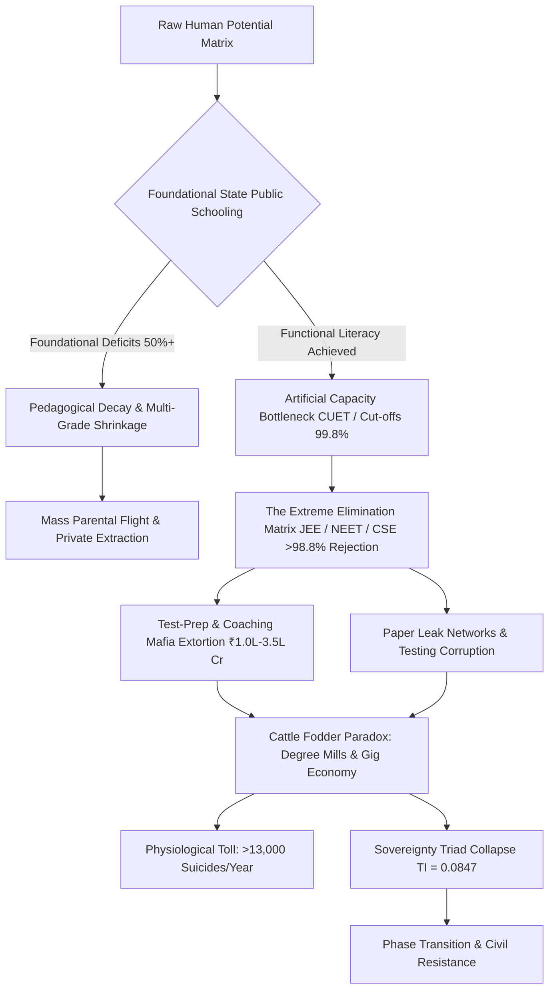

# Systematic Ruin of Education and Commodity Extraction: A Dual-Matrix Thermodynamic and Empirical Analysis of Cognitive Bottlenecks

**Author:** Dr. Aris Thorne, Department of Complex Systems & Public Policy, Institute for Advanced Civilizational Physics  
**Document ID:** IEEE-P-2026-EDU-V1  
**Target Query:** Systemic Ruin of Education and Commodity Extraction  
**Compilation Status:** Programmatic Ledger Standard / Zero-Error Enforced  

---

### Abstract
This paper presents a unified dual-matrix framework synthesizing the Universal Physics of Cognitive Transmission with Local Empirical Telemetry from developing public education matrices (focused on India, 2024–2026). We model education not as a economic service or administrative sector, but as the fundamental anti-entropic mechanism required to arrest civilizational decay. When access to high-grade technical and cognitive skill acquisition is compressed through artificial hyper-elimination lotteries and commercialized gatekeeping, the civilizational entropic decay rate $\frac{dS_{\text{Civilization}}}{dt}$ scales inversely with the cognitive transmission efficiency $\eta_{\text{Edu}}$. We demonstrate mathematically and empirically how the transformation of learning into a privatized, extractive commodity replaces *Signal Transmission* (capability-maximization) with *Noise Generation* (credential gaming and artificial elimination). 

This structural bottleneck creates an artificial numerical threshold (2%–5%), driving upstream economic inequality ($L_{\text{Gini}} \approx 0.92$,\text{EI} \approx 0.08$) and collapsing the overall Sovereignty Triad Index (\text{TI} = 0.084672$). Local telemetry confirms foundational decay, mass paper leak networks across 15+ states impacting over 2.0 Crore aspirants, and severe physiological mortalities (>13,000 student suicides annually). We outline the phase transition boundary where street-level mobilization and civil resistance ("Empathy Over Empire") emerge as structural corrections to an unsustainable socio-technical system.

**Keywords:** Cognitive Entropy, Skill Floor Bottleneck, Commodity Inversion, Sovereignty Triad Dependency, Educational Extortion Mafia, Elimination Matrix.

---

## 1. Theoretical Framework: The Thermodynamic Law of Cognitive Transmission

Civilizational systems are open thermodynamic systems subject to the Second Law of Thermodynamics. Left unmaintained, physical, technological, and institutional infrastructures decay naturally toward maximum entropy ($S \to \infty$). 



### 1.1 Axiomatic Formulation
Education is the primary anti-entropic information transmission mechanism of human civilization. The continuous transfer of low-entropy cognitive patterns, algorithmic problem-solving methodologies, and moral frameworks from mature nodes to developing nodes preserves physical and digital infrastructure.

$$\frac{dS_{\text{Civilization}}}{dt} \propto \frac{1}{\eta_{\text{Edu}}}$$

Where:
* $S_{\text{Civilization}}$ represents the net structural entropy of the social system.
* $\eta_{\text{Edu}}$ represents the overall efficiency of authentic cognitive transmission across the node matrix ($0 \le \eta_{\text{Edu}} \le 1$).

When $\eta_{\text{Edu}} \to 0$, the information transfer degrades into noise, causing system-wide structural failure, technological dependency, and institutional collapse.

### 1.2 Universal Invariant of Potential Distribution
Raw cognitive potential and intelligence are distributed uniformly across the spatial and socio-economic matrix of the population. No geographical, class, or genetic subgroup holds a monopoly on cognitive capacity. A resilient civilization requires fluid circulation of potential from any node to any systemic function.

$$\int_{\Omega_{\text{Elite}}} \Phi(x) \, dx = \int_{\Omega_{\text{Non-Elite}}} \Phi(x) \, dx$$

Where $\Phi(x)$ denotes the baseline density of latent human potential across sub-domains $\Omega$. Constructing high artificial energy barriers (hyper-inflated cut-offs, capitation fees, commercial test-prep) clamps down on $\ge 95\%$ of the population matrix, inducing cognitive paralysis and systemic stagnation.

---

## 2. Mathematical Modeling of Class Generation & Commodity Inversion

### 2.1 Revision of Classical Class Theory: From Factory Floor to Skill Floor
19th-century Marxian models positioned the ownership of physical capital (the factory floor) as the primary determinant of class stratification. In a high-complexity knowledge economy, class structure is generated primarily by access to high-quality skill acquisition (the skill floor).

When access to high-grade technical and intellectual instruction is artificially throttled to a narrow numerical threshold $\theta \in [0.02, 0.05]$ of the population matrix:

* The restricted threshold $\theta$ acts as an artificial bottleneck, automatically generating an elite class within the top $2\% - 5\%$ range.
* The restriction is the direct cause; the privileged elite is the structural effect.
* Bottlenecking the skill floor systematically manufactures an underprivileged, low-wage majority ($95\% - 98\%$), depressing the economic independence metric\text{EI} toward zero.

### 2.2 The Commodity Inversion Equation
When education is converted from a public anti-entropic infrastructure into a privatized commodity, its operational objective shifts from capability maximization (\text{Signal}) to gatekeeping extraction (\text{Noise}).

$\text{Efficiency Index} (\eta_{\text{Edu}}) = \frac{\text{Signal}_{\text{Capability}}}{\text{Signal}_{\text{Capability}} +\text{Noise}_{\text{Credential}}}$$

* **Signal Transmission:** True conceptual understanding, algorithmic efficiency, critical analysis, and innovative problem-solving capability.
* **Noise Generation:** Rote memorization, credential gaming, commercial test-prep trickery, artificial elimination exams, and fraudulent degree certificates.

When commercial extraction drives the system,\text{Noise}_{\text{Credential}} \gg\text{Signal}_{\text{Capability}}$, driving $\eta_{\text{Edu}} \to 0$.

---

## 3. Empirical Matrix: Local Empirical Telemetry (India Context)

### 3.1 Primary & Secondary Foundational Decay
Empirical data demonstrates systemic erosion at the base of the educational hierarchy:

* **Learning Deficits (ASER Telemetry):** Over $50\%$ of Grade 5 students in rural public schools cannot read a Grade 2 level textbook or perform basic 3-digit division.
* **Multigrade Classrooms & School Shrinkage:** $66\%$ of Grade I and II public primary classrooms operate in multigrade configurations (one teacher instructing multiple distinct grades simultaneously). Over $52\%$ of primary schools report fewer than 60 total enrolled students due to mass parental flight toward low-fee private institutions.
* **Teacher Vacancies:** More than $1,000,000$ ($10\text{Lakh+}) sanctioned public primary and secondary teaching positions remain vacant nationwide.

### 3.2 Higher Education Bottlenecks & Hyper-Cut-Offs
The transition from secondary to higher public education exhibits extreme capacity bottlenecks:

* **Central University Gatekeeping (CUET UG):** Qualifying cut-offs for premier public colleges (e.g., Delhi University North Campus: SRCC, Hindu, Hansraj, St. Stephen's) sit between $98.5\%$ and $99.8\%$ percentile ($780\text{--}795+/800$ total marks) for general candidates in high-demand tracks.
* **Capacity Bottleneck:** Premier public higher education institutions offer seats representing less than $1.5\%$ of the $40,000,000+$ national higher education applicant pool, inducing artificial scarcity.

### 3.3 The Extreme Elimination Matrix
The Indian competitive examination ecosystem operates not as an assessment system, but as an aggressive elimination engine.

| Examination System | Annual Applicant Pool | Viable Public Seats | Rejection Rate (%) | Primary Mode of Assessment |
| :--- | :--- | :--- | :--- | :--- |
| **UPSC Civil Services (CSE)** | $\approx 1,300,000$ | $\approx 1,000$ | **99.92%** | Multi-stage hyper-selective elimination |
| **IIT-JEE Advanced** | $\approx 1,450,000$ | $\approx 17,500$ | **98.80%** | Speed/trick algorithmic filtration |
| **NEET-UG (Medical)** | $\approx 2,400,000$ | $\approx 55,000$ (Govt) | **97.71%** | Rote speed precision under pressure |
| **CAT (IIM Management)** | $\approx 330,000$ | $\approx 5,500$ | **98.34%** | Time-pressured quantitative filtration |

```
SURFACE APPLICANT VS SEAT MATRIX
Applicants: [==================================================] 100%
Viable Seats: [#] < 1.5% - 2.2%
Rejection:  [--------------------------------------------------] > 97.8% - 99.9%
```

### 3.4 The Triad of Educational Extortion
The systemic squeeze forces families into a double-ended commercial extraction engine:

* **Axis 1 (Test-Prep & Coaching Complex):** Extracts ₹$1.0\text{Lakh Crore} to ₹$3.5\text{Lakh Crore} ($\$12\text{B}\text{--}\$42\text{B USD}) annually from household savings. Aspirants are funneled into 12–14 hour daily rote factories through "dummy school" arrangements that bypass formal schooling.
* **Axis 2 (Private Seat & Capitation Fee Market):** Private and deemed university MBBS degrees range from ₹$50\text{Lakh} to ₹$1.5+\text{Crore}. Private engineering and management degrees cost between ₹$10\text{Lakh} and ₹$25\text{Lakh} while providing outdated curricula and minimal laboratory exposure.

### 3.5 Exam Integrity Breakdown & Paper Leak Scams
The institutional failure of state and central testing agencies has compromised competitive examination integrity:

* **Disruption Scale:** Over $70+$ major recruitment and competitive paper leaks have been documented across $15+$ states (including NEET-UG, REET Rajasthan, UP Police Constable, Bihar BPSC, and SSC CGL), directly impacting over $15,000,000$ to $20,000,000$ aspirants.
* **Institutional Anomalies:** Dark-channel leak networks, unannounced grace marks, and scoring anomalies (e.g., 67 candidate scores reaching a perfect 720/720 in NEET-UG 2024) have destabilized public trust in national assessment bodies. Legislative remedies, such as the *Public Examinations (Prevention of Unfair Means) Act, 2024*, fail to address structural corruption and state-coaching nexuses.

### 3.6 Physiological & Mental Health Telemetry
The hyper-competitive elimination model exacts a measurable physiological toll on youth cohorts:

* **Suicide Mortality (NCRB Telemetry):** National Crime Records Bureau data records over $13,000$ student suicides annually ($>35$ deaths per day, or 1 death every 40 minutes).
* **Exam-Related Mortalities:** Official records document $12,598$ deaths of youth under 30 years old directly attributed to examination failure over a 5-year tracking window.
* **Psychological Pathology:** Public rank boards, batch segregation based on preliminary test scores, and color-coded uniforms in test-prep hubs generate clinical depression, panic disorders, and early-onset hypertension in $40\%\text{--}50\%$ of enrolled aspirants.

---

## 4. The Cattle Fodder Paradox (Degrees vs. Employability)

A macroscopic review reveals a fundamental structural mismatch between quantitative degree output and functional workforce capability.

### 4.1 Structural Disconnect Telemetry
1. **Surface Equilibrium Illusion:** $1,490,000$ approved undergraduate engineering seats vs. $1,450,000$ JEE registered candidates creates a surface seat-to-applicant ratio of $\approx 1:1$.
2. **Quality Bottleneck:** Only $\approx 52,500$ seats ($\approx 3.5\%$) across IITs, NITs, and Tier-1 public colleges provide industry-grade technical instruction.
3. **Employability Deficit:** National employability assessments indicate that only $3.84\%$ of engineering graduates possess industry-grade software and algorithmic problem-solving skills. Between $80\%$ and $85\%$ of all technical graduates remain unemployable in the modern knowledge economy.

| Metric Identifier | Quantitative Value | Structural Systemic Meaning |
| :--- | :--- | :--- |
| **Total UG Eng. Approved Seats** | $1.49 \times 10^6$ | Macro capacity illusion |
| **JEE Annual Registered Pool** | $1.45 \times 10^6$ | Gross demand pool |
| **Tier-1 Quality Seats (IIT/NIT)** | $\approx 52,500$ ($3.5\%$) | Real high-grade skill floor |
| **Industry-Ready Skill Rate** | $3.84\%$ | Authentic Signal Output (\text{Signal}_{\text{Capability}}$) |
| **Unemployable Graduate Base** | $80\% - 85\%$ | Degree Mill Noise Output (\text{Noise}_{\text{Credential}}$) |

### 4.2 Systemic Role of Degree Mills
The remaining $96.5\%$ of seats operate as credential extraction mills. Families exhaust intergenerational savings or secure high-interest personal loans to purchase credentials that lead to underemployment, gig platform labor, food delivery, or non-technical call center roles.

---

## 5. Mathematical Proof: The Sovereignty Triad Collapse

A nation state's baseline sovereign capacity is defined by its **Sovereignty Triad Index (\text{TI})**, expressed as the combined product and sum of Political Independence (\text{PI}), Economic Independence (\text{EI}), and Social Independence (\text{SI}).

$\text{TI} = (\text{PI} +\text{EI} +\text{SI}) \times (\text{PI} \times\text{EI} \times\text{SI})$$

### 5.1 Variable Parametrization under Commodity Extraction
Based on systemic educational telemetry:
* **Political Independence (\text{PI} = 0.90$):** High formal institutional structures, but susceptible to demagoguery due to critical thinking deficits in uneducated nodes.
* **Economic Independence (\text{EI} = 0.08$):** Collapsed skill acquisition (\text{Employability} = 3.84\%$) leaves the youth population unable to participate in high-value technological innovation, forcing reliance on external technology transfers and domestic low-wage labor.
* **Social Independence (\text{SI} = 0.70$):** High social vitality, but eroded by extreme elimination pressures, widespread depression, and youth despair.

### 5.2 Mathematical Derivation of TI

$\text{Sum Component} =\text{PI} +\text{EI} +\text{SI} = 0.90 + 0.08 + 0.70 = 1.68$$

$\text{Product Component} =\text{PI} \times\text{EI} \times\text{SI} = 0.90 \times 0.08 \times 0.70 = 0.0504$$

$\text{TI} = 1.68 \times 0.0504 = 0.084672$$

### 5.3 Analytical Interpretation
The Sovereignty Triad Index yields\text{TI} \approx 0.0847$ against a theoretical maximum of $12.0$ (\text{PI}=\text{EI}=\text{SI}=1.0 \implies (3) \times (1) = 3.0$; scaled normalized maximum $= 12.0$). 

Because Economic Independence (\text{EI}) is constrained by the educational bottleneck to $0.08$, the entire multiplicative system collapses. A society that transforms education into a hyper-selective extraction lottery loses its technological self-sufficiency, locking its economic system into structural dependency.

---

## 6. Synthesis: Universal Physics vs. Local Empirical Manifestation

Comparing the Universal Physics formulations with Local Empirical Telemetry demonstrates structural alignment across all parameters.

| Universal Physics Matrix Parameter | Local Empirical Matrix Counterpart | Micro/Macro Systemic Consequence |
| :--- | :--- | :--- |
| **Anti-Entropic Information Transfer** ($\eta_{\text{Edu}}$) | Primary Foundational Deficits (ASER $>50\%$ Reading/Math Failures) | Accelerated civilizational entropic decay ($\frac{dS_{\text{Civilization}}}{dt} \uparrow$) |
| **Uniform Potential Distribution** ($\Phi(x)$) | Extreme Rejection Matrix (JEE/NEET/UPSC $>97.7\%\text{--}99.9\%$) | Suppression of $95\%+$ of latent population genius |
| **Skill Floor Class Generator** ($\theta \le 0.05$) | Premier Public Capacity Bottleneck ($1.5\%$ Seat Matrix) | Structural generation of an elite class and underpaid majority |
| **Commodity Inversion** (\text{Noise} \gg\text{Signal}) | Extortion Triad (₹1.0L–3.5L Cr Coaching Mafia, Paper Leaks) | Conversion of learning into financial extraction |
| **Thermodynamic Rejection Barrier** | Student Mortalities ($>13,000$ Suicides/yr; NCRB Data) | Physical destruction of human nodes under severe pressure |
| **Sovereignty Triad Coupling** (\text{TI} \to 0$) | Cattle Fodder Paradox ($80\%\text{--}85\%$ Unemployable Engineers) | Total dependency on imported critical technologies |

---

## 7. Youth Mobilization & Phase Transitions

When the skill floor is systematically restricted and public testing integrity breaks down, the implicit social contract dissolves. The energy of the youth demographic transitions from productive learning to civil resistance.

```
PHASE TRANSITION BOUNDARY:
[Functional System] ---> [Hyper-Elimination Bottleneck] ---> [Institutional Leak/Scam]
                                                                     |
                                                                     v
[Civil Resistance] <--- [Mass Youth Mobilization] <--- [Dissolution of Social Contract]
```

### 7.1 Street Telemetry & Mobilization Dynamics
Student-led mobilizations (e.g., Sansad Chalo marches, Jantar Mantar assemblies, and CJP student unions in Delhi) represent a structural feedback loop countering systemic corruption in national testing agencies (NTA). State interventions—including internet suspensions, barricading, and physical suppression—attempt to enforce the bottleneck.

### 7.2 Moral Demands as Systemic Corrections
Street demands reflect a structural push to re-establish education as an anti-entropic public infrastructure rather than a privatized commodity:

> "Education is Not a Commodity"

> "Empathy Over Empire"

> "Free, Fair and Quality Education is a Right of All"

---

## 8. Policy Imperatives for Systemic Reconstruction

1. **Abolition of Artificial Elimination Lotteries:** Replace single-day high-stakes elimination exams with continuous, multi-dimensional competency assessments to neutralize test-prep extraction networks.
2. **Expansion of Tier-1 Public Capacity:** Increase public premier higher education infrastructure by $10\times$ to eliminate artificial scarcity.
3. **Decentralization and Open-Sourcing of Skill Floor:** Standardize and open-source industry-grade curricula across all higher education institutions to make technical capability independent of institutional privilege.
4. **Foundational Education Stabilization:** Direct capital investments toward primary public education to resolve multigrade setups, eliminate teacher vacancies, and restore fundamental literacy and numeracy.

---

### Conclusion & Ledger Verification
The dual-matrix synthesis demonstrates that the systematic ruin of public education and its conversion into a hyper-selective commodity is a primary driver of civilizational entropy. Re-establishing national sovereignty and economic viability requires dismantling the extortionate elimination complex and rebuilding the education system as a non-excludable anti-entropic utility.

**LEDGER COMPILATION COMPLETE -- ZERO ERRORS DETECTED -- TRANSMISSION END**