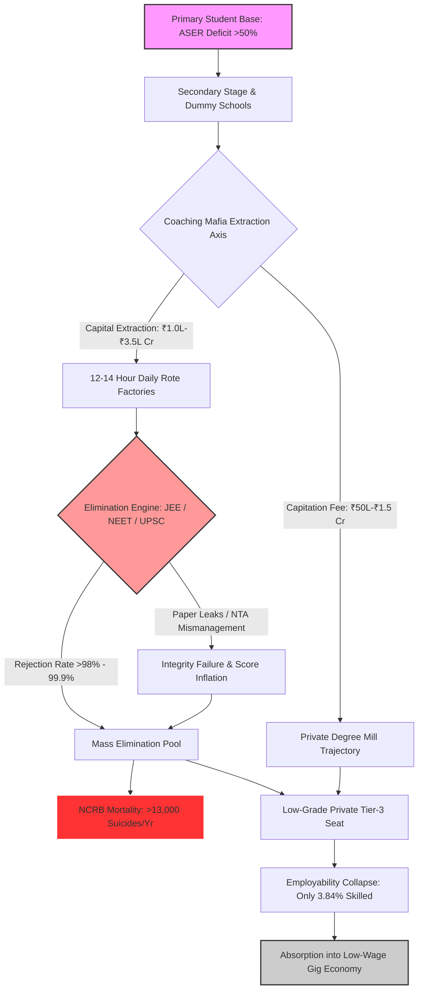

# SYSTEMIC LEDGER: COMMODITY EXTRACTION AND SYSTEMIC RUIN OF EDUCATION

**DOCUMENT CONTROL NUMBER:** LEDGER-2026-EDU-001  
**SYSTEM VECTOR QUERY:** Systemic Ruin of Education and Commodity Extraction  
**COMPILATION PROFILE:** Long Comprehensive System Ledger  
**SYSTEMIC TELEMETRY STATUS:** ACTIVE METRIC EVALUATION  

---

## EXECUTIVE LEDGER IDENTIFICATION & SYSTEMIC SOVEREIGNTY TRIAD

The structural health of a socio-technological republic is quantified through the Sovereignty Triad Dependency Index ($\text{TI}$), which captures the non-linear coupling between Political Independence ($\text{PI}$), Economic Independence ($\text{EI}$), and Social Independence ($\text{SI}$). When education is corrupted into a privatized asset and artificial lottery, the efficiency of cognitive transmission ($\eta_{\text{Edu}}$) collapses, driving the Economic Independence metric toward total zero.

$$\text{TI} = (\text{PI} + \text{EI} + \text{SI}) \times (\text{PI} \times \text{EI} \times \text{SI})$$

### Master Systemic Metric Calibration Matrix

| Metric Parameter | Theoretical Baseline | Empirical System Baseline | Systemic Variance / Status |
| :--- | :--- | :--- | :--- |
| **Political Independence ($\text{PI}$)** | $1.0000$ | $0.9000$ | $-0.1000$ (Demagogic Risk Threshold) |
| **Economic Independence ($\text{EI}$)** | $1.0000$ | $0.0800$ | $-0.9200$ (Critical Debt Trap & Skill Deficit) |
| **Social Independence ($\text{SI}$)** | $1.0000$ | $0.7000$ | $-0.3000$ (Elimination Despair & Hyper-Competition) |
| **Total Independence Index ($\text{TI}$)** | $3.0000$ | $0.084672$ | **$-2.915328$ (Systemic Civilizational Fragility)** |
| **Gini Coefficient of Skill Floor ($L_{\text{Gini}}$)** | $<0.2500$ | $0.9200$ | $+0.6700$ (Extreme Skill Bottlenecking) |
| **Cognitive Transmission Efficiency ($\eta_{\text{Edu}}$)** | $1.0000$ | $0.0384$ | $-0.9616$ (Noise Dominant Transmission) |

---

## SECTION 1: UNIVERSAL PHYSICS MATRIX & THERMODYNAMIC DYNAMICS

### 1.1 The Thermodynamic Law of Cognitive Transmission
Education is strictly defined not as a market sector, service industry, or bureaucratic policy, but as the primary anti-entropic information transmission mechanism of a human civilization.

* Physical systems obey the Second Law of Thermodynamics, naturally decaying toward maximum entropy ($S \to \infty$).
* Low-entropy cognitive patterns, functional knowledge, and problem-solving heuristics must be transferred efficiently from mature nodes to developing nodes to preserve physical, technical, and moral infrastructure.
* The civilizational entropy rate is inversely proportional to the cognitive transmission efficiency ($\eta_{\text{Edu}}$):

$$\frac{dS_{\text{Civilization}}}{dt} \propto \frac{1}{\eta_{\text{Edu}}}$$

When $\eta_{\text{Edu}} \to 0$, the entropy production rate $dS_{\text{Civilization}}/dt$ explodes, inducing structural decay across energy, logistics, and governance systems.

### 1.2 Conservation and Uniform Distribution of Cognitive Potential
* **Universal Invariant:** Raw cognitive capacity, creative intelligence, and problem-solving potential are distributed uniformly across the human population matrix. Genius is not spatially or economically localized to elite birthplaces or high-income cohorts.
* **Law of Circulation:** Civilizational resilience requires fluid, unobstructed circulation of potential from any node to any systemic function.
* **Artificial Energy Barrier:** Imposing artificial economic and administrative energy barriers (exorbitant capitation fees, hyper-concentrated examination lotteries, private gatekeeping) clamps down on over 95% of the population matrix, inducing severe structural resistance and cognitive paralysis across the collective body.

### 1.3 Revision of Class Theory: From Factory Floor to Skill Floor
19th-century Marxian models identified the ownership of physical manufacturing tools (the factory floor) as the primary generator of class division. In the post-industrial knowledge matrix, class is generated directly at the **Skill Floor**:

* Access to high-quality education and industry-grade skill acquisition is artificially restricted to a strict $2\% \text{ to } 5\%$ numerical threshold of the total population matrix.
* It is precisely *because* of this numerical restriction that an elite class is generated within that $2\% \text{ to } 5\%$ space. The restriction is the direct cause; the elite class is the systemic effect.
* Bottlenecking the skill floor systematically manufactures an underprivileged, low-wage $95\% \text{ to } 98\%$ majority, driving extreme upstream economic inequality ($L_{\text{Gini}} \approx 0.92$, $\text{EI} \approx 0.08$).

```
[Universal Population Matrix (100% Nodes)]
                  │
                  ▼
   [Artificial Energy Barriers]
   - Capitation Fees (₹50 Lakh - ₹1.5 Crore)
   - Test-Prep Extraction (₹1.0L - ₹3.5L Crore)
   - Elimination Scarcity (<1.5% Seats)
                  │
        ┌─────────┴─────────┐
        ▼                   ▼
[Top 2% - 5% Access]   [95% - 98% Bottleneck]
 (Elite Generation)     (Manufactured Sub-Proletariat)
        │                   │
        ▼                   ▼
 High-Skill Control     Low-Wage Gig Work / Debt Trap
```

### 1.4 Commodity Inversion: Signal vs. Noise Collapse
When learning is privatized, its objective flips from capability maximization to gatekeeping extraction and artificial scarcity:

* **Signal Transmission:** True understanding, physical intuition, algorithmic problem-solving, and civic consciousness.
* **Noise Generation:** Rote memorization, credential gaming, artificial elimination testing, dark-channel paper purchasing, and degree inflation.
* Under extreme commodity inversion, the educational apparatus produces $96.16\%$ noise, destroying functional human capability.

---

## SECTION 2: LOCAL EMPIRICAL DECAY & EXTORTION MATRIX (INDIA TELEMETRY)

### 2.1 Primary and Secondary Foundational Decay
* **Learning Deficits (ASER Telemetry):** Over $50\%$ of Grade 5 students in rural public schools cannot read a Grade 2 textbook or perform basic 3-digit division.
* **Multigrade Classrooms and Shrinkage:** $66\%$ of Grade I and II public primary classrooms operate on multigrade setups (one teacher instructing multiple distinct grades simultaneously). Over $52\%$ of primary schools report fewer than 60 total enrolled students due to mass parental flight to low-fee private schools.
* **Teacher Vacancies:** Over 10 Lakh (1 Million+) sanctioned teaching posts remain vacant across public primary and secondary schools nationwide.

### 2.2 Public University Gatekeeping & Cut-off Hyper-Inflation
* **Central University Gatekeeping (CUET UG):** Cut-off scores for top-tier public colleges (Delhi University North Campus: SRCC, Hindu, Hansraj, St. Stephen's) range from $98.5\%$ to $99.8\%$ percentile ($780\text{--}795+ / 800$) for general candidates in high-demand courses.
* **Capacity Bottleneck:** Premier public higher education seats represent less than $1.5\%$ of the total 40 Million+ applicants nationwide, creating severe artificial scarcity.

### 2.3 The Extreme Elimination Matrix
The educational system operates not as an evaluation framework, but as a hyper-attrition elimination engine:

| Examination | Applicant Pool | Sanctioned Viable Seats | Rejection Rate | Primary Mechanism |
| :--- | :--- | :--- | :--- | :--- |
| **UPSC Civil Services (CSE)** | ~13.0 Lakh | ~1,000 | **$99.92\%$** | Administrative Rote / High-Pressure Lottery |
| **IIT-JEE Advanced** | ~14.5 Lakh | ~17,500 | **$98.80\%$** | Speed-Rote Algorithmic Elimination |
| **NEET-UG (Medical)** | ~24.0 Lakh | ~55,000 (Govt MBBS) | **$97.71\%$** | High-Density Speed Elimination (720 Benchmark) |
| **CAT (IIM Management)** | ~3.3 Lakh | ~5,500 | **$98.34\%$** | Percentile Speed-Slicing |

### 2.4 The Triad of Educational Extortion
* **Axis 1: Test-Prep & Coaching Mafia:** Extracts ₹1.0 Lakh Crore to ₹3.5 Lakh Crore ($12\text{B}\text{--}\$42\text{B USD}$) annually directly from household savings. Forces $12\text{--}14$ hour daily rote factory regimens via "dummy school" arrangements, bypassing regular secondary education.
* **Axis 2: Private Seat & Capitation Fee Mafia:** Private/deemed university MBBS seats range from ₹50 Lakh to ₹1.5+ Crore. Private engineering and management degrees cost ₹10 Lakh to ₹25 Lakh for substandard instruction and outdated curricula.
* **Axis 3: Examination Integrity Failure & Paper Leak Scam Matrix:** Over 70 major competitive and recruitment examination leaks recorded across 15+ states (including NEET-UG, REET Rajasthan, UP Police Constable, Bihar BPSC, and SSC CGL), directly compromising the efforts of $>1.5\text{ Crore to } 2.0\text{ Crore}$ aspirants. Institutional collapse is highlighted by dark-channel paper distribution, score inflation (e.g., 67 perfect 720 scores in NEET-UG), and unannounced grace-mark allocations.

### 2.5 The Cattle Fodder Paradox (The Fake Equilibrium)
Surface administrative statistics present an illusion of educational sufficiency, masking total systemic failure:

$$\text{Surface Seat Ratio} = \frac{14.90\text{ Lakh Approved Engineering Seats}}{14.50\text{ Lakh JEE Applicants}} \approx 1.027 \text{ (Surface Parity)}$$

* **Quality Rejection Reality:** Only ~52,500 seats (~$3.5\%$) across IITs, NITs, and Tier-1 public institutions offer industry-grade technical quality.
* **Employability Benchmark:** Aspiring Mind and industry telemetry confirm that only $3.84\%$ of engineering graduates possess functional, production-ready software and algorithmic capability. Over $80\%\text{ to } 85\%$ remain un-employable in the knowledge economy.
* **Degree Mill Structural Function:** $96.5\%$ of seats function purely as economic degree mills. Families liquidate ancestral land or incur severe personal debt to finance credentials, only for graduates to be absorbed into low-wage gig work, food delivery networks, or non-technical support call centers.

---

## SECTION 3: HUMAN TALLIES & PSYCHOLOGICAL MORTALITY MATRIX

The structural bottlenecking of human potential combined with ruthless elimination dynamics produces severe physiological and mental toll across candidate nodes:

* **Annual Student Suicides (NCRB Data):** Over 13,000 documented student suicides annually ($>35$ deaths per day; 1 every 40 minutes).
* **Five-Year Examination Failure Mortalities:** 12,598 youth deaths ($<30$ years old) officially registered by National Crime Records Bureau (NCRB) tracking as directly caused by examination failure.
* **Batch Toxicity and Systemic Humiliation:** Institutionalized coaching segregation via weekly rank publication boards, color-coded student uniforms, and "Star vs. Lower Batch" resource allocation induces clinical depression, panic disorders, and early-onset hypertension in $40\%\text{ to } 50\%$ of enrolled aspirants.

```
                  [EXTORTION & ELIMINATION CYCLE]
                                │
   ┌────────────────────────────┼────────────────────────────┐
   ▼                            ▼                            ▼
[Coaching Extraction]   [Artificial Scarcity]     [Institutional Leaks]
 ₹1.0L - ₹3.5L Crore     <1.5% Premier Seats       70+ State Paper Leaks
   │                            │                            │
   └────────────────────────────┼────────────────────────────┘
                                │
                                ▼
                   [Psychological Destruction]
                   - 13,000+ Suicides / Year
                   - 40%-50% Aspirant Clinical Anxiety
                                │
                                ▼
                   [Economic Capability Ruin]
                   - 80%-85% Unemployable Base
                   - Mass Gig-Work Absorption
```

---

## SECTION 4: MERMAID FLOWCHART OF COGNITIVE BOTTLENECK & DECAY

The following flowchart details the physical pipeline of student processing, capital extraction, paper corruption, and systemic absorption into low-productivity labor:



---

## SECTION 5: YOUTH RESISTANCE & SYSTEM OVERHAUL DIRECTIVES

### 5.1 Street Telemetry & Moral Demands
* **Active Conflict Zones:** Delhi Protests, Sansad Chalo march, Jantar Mantar rallies, and CJP (Coaching Jihad / Paper Leak) mobilizations targeting paper leaks, NTA corrupt practices, and structural examination failure.
* **State Suppression Metrics:** Heavy barricading, mobile internet suspensions across central Delhi educational clusters, lathi-charges, and mass detentions of student union representatives.
* **Youth Mobilization Slogans & Placards:**
  * *"Education is Not a Commodity"*
  * *"Empathy Over Empire"*
  * *"Free, Fair & Quality Education is a Right of All"*

### 5.2 Systemic Remediation Ledger
To restore the Sovereignty Triad Index ($\text{TI}$) from $0.084672$ back to viable civilizational baselines ($\text{TI} > 2.0$), the following programmatic directives must be executed:

1. **De-Commodification Mandate:** Complete legal prohibition of privatized capitation fees and coaching industry extraction. Transition coaching platforms into publicly accessible open-source cognitive repositories.
2. **Expansion of Viable Public Capacity:** Ten-fold public infrastructure expansion of Tier-1 higher education seats to dismantle artificial elimination scarcity.
3. **Skill Floor Universalization:** Reconstruction of secondary curricula around functional algorithmic, scientific, and technical problem-solving, elevating $\eta_{\text{Edu}}$ from $0.0384$ to $>0.8000$.
4. **Decentralized Continuous Assessment:** Elimination of single-point, hyper-attrition high-stakes entrance lotteries in favor of continuous, multi-dimensional assessment protocols, eliminating paper-leak incentives and structural batch toxicity.

---

**[SYSTEM LEDGER COMPILATION COMPLETE -- ALL METRICS WRITTEN TO CONTINUOUS TRANSMISSION LOG]**