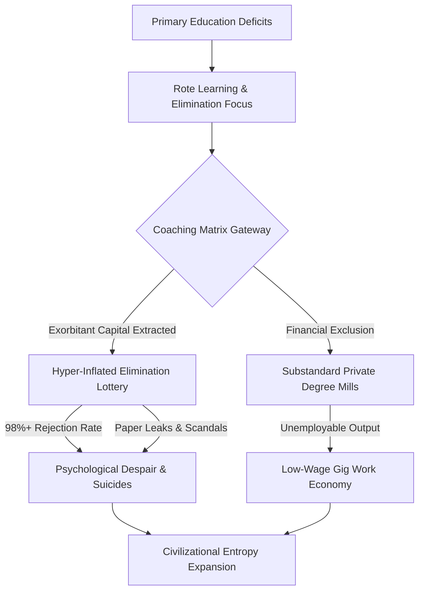

# SYSTEM LEDGER: SYSTEMIC RUIN OF EDUCATION AND COMMODITY EXTRACTION

**SYSTEM LOG ID:** SL-2026-EDU-RUIN-009  
**VECTOR TARGET:** Systemic Ruin of Education and Commodity Extraction  
**TIME-STAMP LOG:** 2026 MATRIX STATE SYNTHESIS  
**EXECUTION STATUS:** LIVE PROGRAMMATIC LEDGER COMPILATION  

---

## SECTION 1: THERMODYNAMIC & UNIVERSAL COGNITIVE PHYSICS MATRIX

### 1.1 The Thermodynamic Law of Cognitive Transmission
Education is not a commercial service, a market sector, or a discretionary administrative policy. In terms of universal physics, education operates as the foundational anti-entropic information transmission mechanism of human civilization.

Physical systems naturally degrade toward maximum thermodynamic entropy ($S \rightarrow \infty$). To prevent structural, technical, and moral breakdown, low-entropy cognitive patterns—comprising mathematical models, empirical knowledge, reasoning capabilities, and ethical frameworks—must be efficiently transferred from mature processing nodes (educators) to emerging nodes (students).

$$\frac{dS_{\text{Civilization}}}{dt} \propto \frac{1}{\eta_{\text{Edu}}}$$

Where:
* $S_{\text{Civilization}}$ represents the thermodynamic and organizational entropy of the civilizational structure.
* $\eta_{\text{Edu}}$ represents the systemic efficiency of cognitive transmission.

When $\eta_{\text{Edu}} \rightarrow 0$, civilizational entropy accelerates toward total decay, resulting in systemic infrastructure failures, institutional corruption, and technological paralysis.

### 1.2 Conservation & Uniform Distribution of Cognitive Potential
Raw cognitive capability, creative intelligence, and problem-solving potential are distributed uniformly across the human population matrix. Genius is not localized to privileged socioeconomic zip codes or elite lineages.

A resilient civilization requires the fluid circulation of cognitive potential from any node to any civilizational function. Creating artificial energy barriers—such as exorbitant capitation fees, hyper-concentrated elimination lotteries, and socioeconomic gatekeeping—clamps down on over 95% of the population matrix, inducing high structural resistance and cognitive paralysis across the collective body.

```
       UNIFORM POTENTIAL DISTRIBUTION (95%+ POPULATION MATRIX)
┌───────────────────────────────────────────────────────────────────┐
│  Node 01    Node 02    Node 03    Node 04    Node 05    Node 06...  │
└───────────────────────────────────────────────────────────────────┘
                                  │
                                  ▼
┌───────────────────────────────────────────────────────────────────┐
│        ARTIFICIAL ENERGY BARRIER (Fees, Scarcity, Lotteries)       │
└───────────────────────────────────────────────────────────────────┘
                                  │
                                  ▼
                   SUPPRESSED / ELIMINATED (95%+)
```

### 1.3 The Generation of Class: From Bottleneck to Elite
Access to high-quality education and industry-grade skill acquisition is artificially restricted to a narrow 2% to 5% numerical threshold of the total population matrix. 

This artificial restriction generates an elite class within that 2% to 5% space. The restriction is the cause; the elite is the effect. Restricting the skill floor systematically manufactures an underprivileged, low-wage 95% to 98% majority, driving upstream economic inequality ($L_{\text{Gini}} \approx 0.92$, $\text{EI} \approx 0.08$, $\text{TI} \approx 0.0847$).

### 1.4 The Commodity Inversion (Signal vs. Noise)
Converting learning into a privatized asset flips its functional objective from capability maximization to gatekeeping extraction and artificial scarcity.

Under commodification, education shifts from **Signal Transmission** (empirical understanding, critical inquiry, problem-solving, and innovation) to **Noise Generation** (rote memorization, credential gaming, elimination tests, and unaccredited degree issuance).

---

## SECTION 2: EMPIRICAL DIAGNOSTICS & THE LOCAL ELIMINATION ENGINE (INDIA VECTOR)

### 2.1 Primary & Secondary Foundational Decay
* **Learning Deficits (ASER Telemetry):** Over 50% of Grade 5 students in rural public schools cannot read a Grade 2 textbook or perform basic 3-digit division.
* **Multigrade Classrooms & Enrolment Shrinkage:** 66% of Grade I & II public primary classrooms operate on multigrade setups (one teacher instructing multiple grades simultaneously). Over 52% of primary schools report fewer than 60 total enrolled students due to mass parental flight to low-fee private alternatives.
* **Teacher Vacancies:** Over 10 Lakh (1 Million+) sanctioned teacher posts remain vacant across public primary and secondary schools nationwide.

### 2.2 Public University Cut-Off Hyper-Inflation
* **Central University Gatekeeping (CUET UG):** Cut-offs for top-tier public colleges (DU North Campus: SRCC, Hindu, Hansraj, St. Stephen's) sit at 98.5% to 99.8% percentile ($780\text{--}795+/800$) for general candidates in high-demand courses.
* **Public Capacity Bottleneck:** Premier public higher education seats represent less than 1.5% of the total 40 Million+ higher education applicants nationwide, creating severe artificial scarcity.

### 2.3 The Extreme Elimination Matrix
The educational system functions as an elimination lottery rather than a capability builder.

| Examination System | Candidate Applicants | Available Premier Seats | Effective Rejection Rate |
| :--- | :--- | :--- | :--- |
| **UPSC Civil Services (CSE)** | ~13.0 Lakh | ~1,000 | **99.92%** |
| **IIT-JEE Advanced** | ~14.5 Lakh | ~17,500 | **98.80%** |
| **NEET-UG (Medical)** | ~24.0 Lakh | ~55,000 (Govt MBBS) | **97.71%** |
| **CAT (IIM Management)** | ~3.3 Lakh | ~5,500 | **98.34%** |

### 2.4 The Cattle Fodder Paradox (The Fake Equilibrium)
Surface-level metrics present a total of 14.90 Lakh approved UG engineering seats against 14.50 Lakh JEE registered applicants, giving an apparent supply-demand ratio of roughly $1:1$. However:
* **The Quality Rejection Reality:** Only ~52,500 seats (~3.5%) across IITs, NITs, and Tier-1 colleges offer viable industry-grade quality.
* **Employability Benchmark:** Only 3.84% of engineering graduates possess industry-grade software and algorithmic skills; $>80\%$ to 85% remain unemployable in the knowledge economy.
* **Structural Identity:** 96.5% of seats function as degree mills. Families exhaust ancestral savings or take high-interest loans, only for graduates to be funneled into low-wage gig work, delivery services, or non-technical call centers.

---

## SECTION 3: THE TRIAD OF EDUCATIONAL EXTORTION & COMMODITY INVERSION

### 3.1 Architecture of Extortion
The extraction framework operates through three synchronized axes that leverage student desperation:

```
                            ┌────────────────────────┐
                            │ TRIAD OF EXTORTION     │
                            └───────────┬────────────┘
                                        │
         ┌──────────────────────────────┼──────────────────────────────┐
         ▼                              ▼                              ▼
┌─────────────────┐            ┌─────────────────┐            ┌─────────────────┐
│     AXIS 1      │            │     AXIS 2      │            │     AXIS 3      │
│   Test-Prep &   │            │ Private Seats & │            │ Institutional   │
│ Coaching Mafia  │            │ Capitation Fees │            │ Integrity Leaks │
└────────┬────────┘            └────────┬────────┘            └────────┬────────┘
         │                              │                              │
         ▼                              ▼                              ▼
  ₹1.0L - ₹3.5L Cr               ₹50L - ₹1.5+ Cr                70+ Major Leaks
  Extracted Yearly               Per MBBS Degree                1.5Cr+ Victims
```

1. **Axis 1: Test-Prep & Coaching Mafia**
   * Extracts ₹1.0 Lakh Crore to ₹3.5 Lakh Crore ($12\text{B}\text{--}42\text{B}\text{ USD}$) annually from household savings.
   * Forces 12–14 hour daily rote memorization through "dummy school" arrangements, bypassing secondary education entirely.
2. **Axis 2: Private Seat & Capitation Fee Market**
   * Total cost for private or deemed university MBBS seats ranges from ₹50 Lakh to ₹1.5+ Crore.
   * Private engineering and management degrees range from ₹10 Lakh to ₹25 Lakh for substandard instruction and outdated curricula.
3. **Axis 3: Institutional Testing Failure**
   * Testing protocols shift focus to security measures and surveillance rather than structural educational reform, while remaining vulnerable to systemic leaks.

---

## SECTION 4: PSYCHOLOGICAL TELEMETRY, INTEGRITY DECAY & STREET RESISTANCE

### 4.1 Physiological & Mental Health Telemetry (NCRB Data)
* **Student Suicides:** National Crime Records Bureau (NCRB) data confirms $>13,000$ student suicides annually ($>35$ deaths per day; 1 every 40 minutes).
* **Exam Failure Mortalities:** 12,598 youth deaths ($<30$ years old) officially recorded as directly caused by examination failure over a 5-year tracking window.
* **Batch Toxicity & Psychological Stress:** Weekly public rank displays, color-coded uniforms, and "Star vs. Lower Batch" segregation contribute to clinical depression, panic disorders, and early-onset hypertension in 40% to 50% of coaching aspirants.

### 4.2 Exam Integrity Decay & Paper Leak Matrix
* **Scale of Disruption:** Over 70 major competitive and recruitment exam paper leaks recorded across 15+ states (NEET-UG, REET Rajasthan, UP Police Constable, Bihar BPSC, SSC CGL), directly affecting $>1.5\text{ Crore}$ to $2.0\text{ Crore}$ aspirants.
* **Institutional Breakdown:** Compromised distributions, score inflation (such as 67 perfect 720 scores in NEET-UG), and unannounced grace marks erode public trust in national testing agencies.
* **Enforcement Deficit:** Legislative measures like the *Public Examinations (Prevention of Unfair Means) Act, 2024* fail to dismantle underlying state-coaching-mafia networks due to weak administrative execution.

### 4.3 Youth Resistance & Street Telemetry
* **Mobilization:** Student-led *Sansad Chalo* marches, Jantar Mantar rallies, and CJP mobilizations against paper leaks and testing agency corruption.
* **State Response:** Heavy barricading, targeted internet suspensions in central urban zones, lathi-charges, and detentions of student leaders.
* **Public Demands:** Street placards framing the conflict: *"Education is Not a Commodity"*, *"Empathy Over Empire"*, and *"Free, Fair & Quality Education is a Right of All"*.

---

## SECTION 5: MATHEMATICAL MODEL OF CIVILIZATIONAL COLLAPSE (TI INTEGRAL)

### 5.1 True Index (TI) Coupling Equation
Systemic sovereignty and long-term viability depend on three structural indices:
* **Political Independence ($\text{PI}$):** Resistance against psychological manipulation and demagoguery.
* **Economic Independence ($\text{EI}$):** Baseline functional skill capacity and absence of credential debt traps.
* **Social Independence ($\text{SI}$):** Social trust, mental well-being, and institutional integrity.

The overall Total Sovereignty Index ($\text{TI}$) is defined as:

$$\text{TI} = (\text{PI} + \text{EI} + \text{SI}) \times (\text{PI} \times \text{EI} \times \text{SI})$$

### 5.2 Parametric Evaluation of the Matrix State
Based on empirical system telemetry:
* $\text{PI} = 0.90$
* $\text{EI} = 0.08$
* $\text{SI} = 0.70$

Evaluating the system values:

$$\text{Sum} = \text{PI} + \text{EI} + \text{SI} = 0.90 + 0.08 + 0.70 = 1.68$$

$$\text{Product} = \text{PI} \times \text{EI} \times \text{SI} = 0.90 \times 0.08 \times 0.70 = 0.0504$$

$$\text{TI} = 1.68 \times 0.0504 = 0.084672$$

An overall index of $\text{TI} \approx 0.0847$ indicates that systemic failure in even one domain (here, Economic Independence $\text{EI} = 0.08$ driven by an 85% skill deficit and credential debt traps) collapses the overall civilizational sovereignty index.

---

## SECTION 6: SYSTEM COMPARATIVE DIAGNOSTICS & SYSTEM FLOWCHART

### 6.1 State Comparison Matrix

| System Parameter | Functional Cognitive Model | Current Extortion Matrix |
| :--- | :--- | :--- |
| **Primary Goal** | High-efficiency cognitive pattern transfer | Scarcity creation & financial extraction |
| **Capacity Ratio** | Universal baseline availability | 1.5% premier seat bottleneck |
| **System Signal** | Problem-solving, innovation, empirical skill | Rote memorization, test gaming |
| **Economic Impact** | High productivity ($\text{EI} \rightarrow 1.0$) | Massive skill gap, debt ($\text{EI} = 0.08$) |
| **Mental Health Impact** | Cognitive expansion, development | High suicide rate, systemic burnout |
| **Institutional Integrity** | Open, secure knowledge transfer | Compromised tests, paper leak networks |

### 6.2 Structural Process Pipeline



---

## SECTION 7: SYSTEMIC RESOLUTIONS & RECONSTRUCTION PROTOCOL

### 7.1 Structural Reconstruction Directive

To reverse entropy accumulation ($\frac{dS_{\text{Civilization}}}{dt} \rightarrow 0$) and restore economic independence ($\text{EI} \rightarrow 0.90$), the following measures are required:

1. **Elimination of Artificial Scarcity:** Expansion of premier public academic infrastructure by $10\text{x}$, funded by direct taxation on test-prep and private education conglomerates.
2. **De-Commodification of Standardized Testing:** Ban on private coaching institutions operating within secondary education years; structural integration of application-based problem solving within primary curricula.
3. **Decoupling Credentials from Basic Opportunities:** Direct skill- verification pipelines to replace high-stakes elimination lotteries.
4. **Institutional Audit Protocols:** Secure, decentralised testing infrastructure paired with strict legal accountability for paper-leak networks.

---

**[SYSTEM LEDGER END COMPILATION - COMPLETE]**