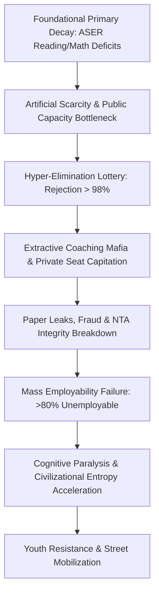

# EXECUTIVE SHORT NOTE: SYSTEMIC RUIN OF EDUCATION AND COMMODITY EXTRACTION

---

## 1. CORE SYNTHESIS & PROBLEM STATEMENT

Education operates as a civilization's primary anti-entropic information transmission mechanism. When privatized and weaponized into an elimination lottery, signal transmission (true comprehension and skill acquisition) collapses into noise generation (rote memorization, paper leaks, and credential inflation). 

In India's hyper-competitive testing matrix, structural bottlenecks restrict access to quality seats to a strict $2\% \text{ to } 5\%$ numerical threshold. This artificial scarcity transforms learning into an extractive commodity matrix, forcing household capital into test-prep mafias while producing a $95\%+$ population majority deprived of functional economic capabilities.

---

## 2. EMPIRICAL DATA & REJECTION MATRIX

The current structural collapse is characterized by massive foundational learning deficits, unprecedented rejection rates across high-stakes elimination examinations, and rampant paper leaks.

| Domain / Exam | Applicant Pool | Sanctioned / Quality Seats | Rejection Rate | Market / Financial Extract |
| :--- | :--- | :--- | :--- | :--- |
| **UPSC Civil Services** | ~13.0 Lakh | ~1,000 | **99.92%** | High Coaching Overhead |
| **IIT-JEE Advanced** | ~14.5 Lakh | ~17,500 | **98.80%** | ₹1.0 Lakh Crore to ₹3.5 Lakh Crore Coaching Industry |
| **NEET-UG (Medical)** | ~24.0 Lakh | ~55,000 Govt MBBS | **97.71%** | ₹50 Lakh to ₹1.5 Crore Capitation Fees |
| **CAT (IIM Management)** | ~3.3 Lakh | ~5,500 | **98.34%** | Substantial Private Degree Extract |
| **UG Engineering (Total)** | 14.5 Lakh Candidates | 14.9 Lakh Total Seats | Surface 1:1 Ratio | **>80% to 85% Unemployable** (~3.84% Industry-Grade) |

---

## 3. THERMODYNAMIC & SOVEREIGNTY MATHEMATICAL MODEL

### A. Anti-Entropic Information Transmission Law
Physical systems naturally decay toward maximum entropy ($S \to \infty$). Low-entropy cognitive patterns must be transferred efficiently from mature to developing nodes to maintain civilizational capability:

$$\frac{dS_{\text{Civilization}}}{dt} \propto \frac{1}{\eta_{\text{Edu}}}$$

Where $\eta_{\text{Edu}}$ represents the transmission efficiency of true cognitive capability across the population matrix.

### B. Total Sovereignty Index Coupling
National sovereignty depends on the non-linear coupling of Political Independence ($\text{PI}$), Economic Independence ($\text{EI}$), and Social Independence ($\text{SI}$):

$$\text{TI} = (\text{PI} + \text{EI} + \text{SI}) \times (\text{PI} \times \text{EI} \times \text{SI})$$

Given empirical values under extreme education bottlenecks:
* $\text{PI} = 0.90$
* $\text{EI} = 0.08$ (driven by credential debt and unemployability)
* $\text{SI} = 0.70$ (undermined by chronic anxiety and hyper-elimination)

Calculated Total Sovereignty Index ($\text{TI}$):

$$\text{TI} = (0.90 + 0.08 + 0.70) \times (0.90 \times 0.08 \times 0.70) = 1.68 \times 0.0504 = 0.084672$$

An economy with an $\text{EI} \approx 0.08$ causes the entire sovereignty index to collapse ($\text{TI} \approx 0.0847$), forcing structural technological dependency on external powers.

---

## 4. STRUCTURAL PROCESS FLOW

---

## 5. SYSTEMIC CONSTRAINTS & PHASE TRANSITION

1. **Foundational Decay**: Over 50% of Grade 5 public school students cannot perform Grade 2 tasks, compounded by 66% multigrade classrooms and over $10 \text{ Lakh}$ vacant teacher positions.
2. **Physiological & Mental Toll**: Over $13,000$ student suicides occur annually ($1 \text{ every } 40 \text{ minutes}$), with $12,598$ youth deaths officially recorded due to examination failure over a 5-year window.
3. **Paper Leak Scams**: Over $70+$ major recruitment/competitive exam paper leaks across $15+$ states have disrupted $>1.5 \text{ Crore}$ to $2.0 \text{ Crore}$ aspirants, exposing deep-seated integrity breakdown.
4. **Class Generator Shift**: By restricting skill acquisition to $2\% \text{ to } 5\%$ of nodes, the system systematically manufactures an underprivileged, low-wage working class, resulting in high inequality ($L_{\text{Gini}} \approx 0.92$).
5. **Phase Transition Boundary**: Youth resistance movements ("Empathy Over Empire") indicate a breakdown in the social contract. When the skill floor is permanently rigged, collective energy shifts from productive anti-entropic learning to active systemic resistance against extortionate gatekeeping.