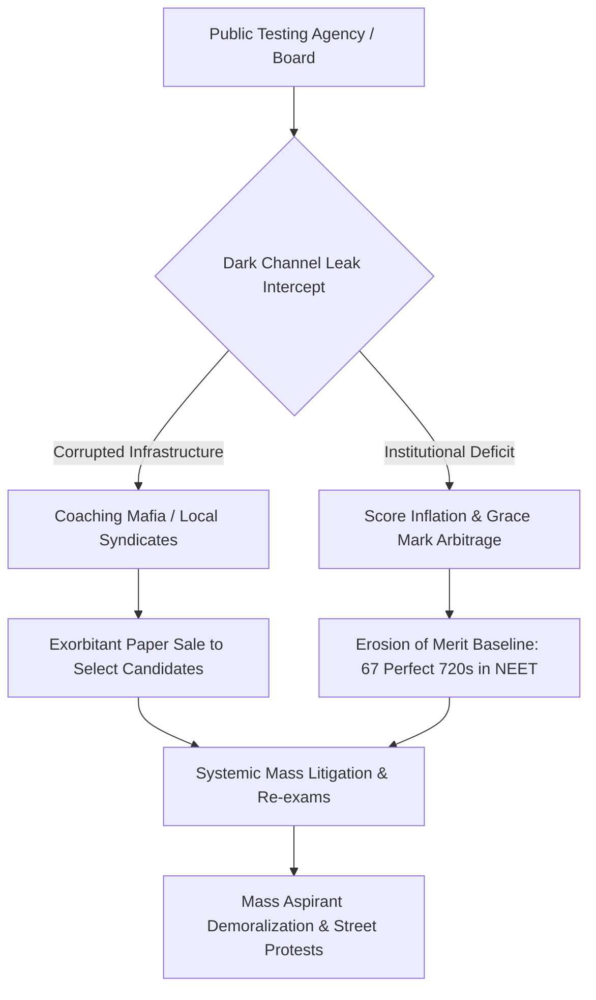

# SYSTEM LEDGER: COMPREHENSIVE SYSTEMIC AUDIT OF EDUCATION & COMMODITY EXTRACTION

**SYSTEM TELEMETRY METADATA**  
- **System Target Vector:** Systemic Ruin of Education and Commodity Extraction  
- **Temporal Baseline:** Live 2026 Telemetry Tracking  
- **Audit Classification:** Comprehensive Master System Ledger  
- **Primary Metric Coupling:** Sovereignty Triad Index $(\text{TI})$ & Cognitive Efficiency ($\eta_{\text{Edu}}$)

---

## 1. EXECUTIVE SYSTEMIC TELEMETRY & VECTOR PROFILE

The systematic degradation of educational systems represents a critical structural failure mode in civilizational infrastructure. Education, when inverted from a public anti-entropic cognitive transmission system into a hyper-monetized elimination extraction mechanism, converts potential cognitive energy into structural friction, social stratification, and systemic ruin.

| System Variable | Baseline Value | Degraded Operational State | Impact Assessment |
| :--- | :--- | :--- | :--- |
| **Cognitive Transmission Efficiency ($\eta_{\text{Edu}}$)** | $1.00$ (Optimal Transmission) | $0.0384$ (3.84% Industry-Grade Skill) | Systemic Cognitive Failure; $>80\%$ Unemployable Base |
| **Primary Classroom Multigrade Ratio** | 0.00% | 66.00% (Grade I & II Multigrade) | Foundational Decay; Mass Cognitive Atrophy |
| **Coaching Extraction Capital Flow** | ₹0.0 Crore | ₹1.0 Lakh Crore – ₹3.5 Lakh Crore | Household Asset Stripping ($12\text{B}–$42\text{B} USD) |
| **Elimination Rate (Top Recruitment/Entrance)** | 10.00% (Functional) | $97.71\% - 99.92\%$ Elimination | Hyper-Bottlenecking & Artificial Scarcity |
| **Triad Index $(\text{TI})$ Target** | $1.0000$ (Full Sovereignty) | $0.0847$ (Collapse Threshold) | Total Sovereignty Depletion |

---

## 2. UNIVERSAL THERMODYNAMIC & MATHEMATICAL FOUNDATIONS

### 2.1 The Thermodynamic Law of Cognitive Transmission
Education is the non-negotiable thermodynamic mechanism through which a complex civilization resists entropy. Physical systems naturally decay toward maximum entropy ($S \to \infty$). To maintain structural, technical, and moral baseline continuity, low-entropy cognitive information must be transferred efficiently from mature nodes to developing nodes.

The rate of civilizational entropic decay is inversely proportional to cognitive transmission efficiency ($\eta_{\text{Edu}}$):

$$\frac{dS_{\text{Civilization}}}{dt} \propto \frac{1}{\eta_{\text{Edu}}}$$

Where:
* $S_{\text{Civilization}}$ represents the entropic disorder of the social and technological system.
* $\eta_{\text{Edu}}$ represents the efficiency of non-distorted cognitive transmission across population nodes.

When $\eta_{\text{Edu}} \to 0$, $dS_{\text{Civilization}}/dt \to \infty$, triggering structural disintegration of institutional systems.

### 2.2 Conservation and Uniform Distribution of Potential
Raw cognitive capacity is uniformly distributed across the human population matrix. Intelligence and creative capacity are non-localized invariants that do not correlate with geographic or economic status. 

When artificial energy barriers (high fees, capitation extraction, hyper-concentrated elimination lotteries) are erected around the skill acquisition floor, the circulation of cognitive potential is restricted to a minor sub-population.

```
[Universal Cognitive Pool] ---> |Artificial Barrier| ---> [2% - 5% Elite Gateway]
                                         |
                                         +---> [95% Structural Atrophy & Exclusion]
```

### 2.3 The Skill Bottleneck as Class Generator
The generation of an elite class is driven by artificial numerical restrictions at the skill floor. Restricting access to high-quality technical and analytical capabilities to a $2\%–5\%$ numerical bottleneck generates an elite class within that band. 

This bottleneck systematically manufactures an underprivileged, low-wage $95\%–98\%$ base, altering economic distribution parameters ($L_{\text{Gini}} \approx 0.92$, $\text{EI} \approx 0.08$).

---

## 3. LOCAL EMPIRICAL AUDIT: FOUNDATIONAL DECAY & ELIMINATION MATRIX

### 3.1 Primary & Secondary Foundational Decay
* Primary Learning Deficits: Over 50% of Grade 5 students in rural public schools cannot read a Grade 2 textbook or execute basic 3-digit division.
* Multigrade Shrinkage: 66% of Grade I and II public primary classrooms operate in multigrade setups. Over 52% of primary schools report $<60$ total enrolled students due to structural flight to low-fee private institutions.
* Systemic Vacancies: Over $10\text{ Lakh}$ ($1\text{ Million}+$) sanctioned public teaching positions remain unfilled nationwide.

### 3.2 Hyper-Concentrated Elimination Statistics
The operational landscape of competitive examinations demonstrates an extreme elimination paradigm:

| Examination Vector | Total Applicant Pool | Available Quality Seats | Rejection Rate (%) | Operational Mode |
| :--- | :--- | :--- | :--- | :--- |
| **UPSC Civil Services (CSE)** | $\sim 13.0\text{ Lakh}$ | $\sim 1,000$ | 99.92% | Mass Structural Elimination |
| **IIT-JEE Advanced** | $\sim 14.5\text{ Lakh}$ | $\sim 17,500$ | 98.80% | Extreme Bottlenecking |
| **CAT (IIM Management)** | $\sim 3.3\text{ Lakh}$ | $\sim 5,500$ | 98.34% | Executive Filtering |
| **NEET-UG (Medical Govt)** | $\sim 24.0\text{ Lakh}$ | $\sim 55,000$ | 97.71% | Medical Access Gatekeeping |
| **CUET UG (Top Public)** | $\sim 40.0\text{ Million}$ (Seats $<1.5\%$) | Cut-off $98.5\% - 99.8\%$ | $>98.50\%$ | Hyper-Inflated Gatekeeping |

---

## 4. ECONOMIC EXTRACTION & COMMODITY INVERSION

### 4.1 The Triad of Educational Extortion
The conversion of learning into a privatized asset shifts educational objectives from capability maximization to capital extraction and artificial scarcity.

```
                   +----------------------------------+
                   |  COMMODITY INVERSION MECHANISM   |
                   +----------------------------------+
                                    |
          +-------------------------+-------------------------+
          |                                                   |
          v                                                   v
+-----------------------------------+               +-----------------------------------+
|     AXIS 1: TEST-PREP MAFIA       |               |     AXIS 2: CAPITATION MAFIA      |
|  * Extracted: ₹1.0L Cr - ₹3.5L Cr |               |  * Private MBBS: ₹50L - ₹1.5+ Cr  |
|  * 12-14 hr Rote Factories        |               |  * Private Eng/Mgmt: ₹10L - ₹25L  |
|  * Dummy School Arrangements      |               |  * Outdated Curricula & Facilities|
+-----------------------------------+               +-----------------------------------+
```

### 4.2 Physiological & Human Telemetry Impact
* **NCRB Student Suicides:** National Crime Records Bureau records confirm $>13,000$ student suicides annually ($>35$ deaths per day; 1 every 40 minutes).
* **Examination Failure Mortalities:** $12,598$ youth deaths ($<30$ years old) officially documented as directly caused by examination failure over a 5-year tracking window.
* **Batch Toxicity:** Public rank boards, color-coded uniforms, and "Star vs. Lower Batch" segregation correlate with clinical depression and anxiety in $40\%–50\%$ of coaching aspirants.

---

## 5. THE EXAM INTEGRITY CRISIS & PAPER LEAK SCAM MATRIX

The integrity of state evaluation engines has experienced structural failures through systemic compromise:



* **Scale of Disruption:** Over 70 major competitive and recruitment examination leaks across 15+ states (NEET-UG, REET, UP Police Constable, BPSC, SSC CGL) directly impacting $>1.5\text{ Crore}$ to $2.0\text{ Crore}$ aspirants.
* **Institutional Deficit:** The Public Examinations (Prevention of Unfair Means) Act, 2024 has not fully eliminated dark-channel state-coaching-mafia networks.

---

## 6. STRUCTURAL IDENTITY & COMPARATIVE SYSTEM DATA

### 6.1 The Cattle Fodder Paradox (Degree Mill Equilibrium)
Surface indicators present an apparent equilibrium (14.90 Lakh UG Engineering Seats vs. 14.50 Lakh JEE Registered Applicants). However, qualitative analysis reveals severe structural disparity:

```
[Total Seats: 14.90 Lakh] ==================================================> (100%)
[Quality Tier-1 Seats]   ===> (3.5% / ~52,500 Seats)
[Employable Graduates]   ==> (3.84% Industry-Grade Skill)
```

### 6.2 Quantitative Structural Matrix

| System Vector | Quality Baseline Sector | Extractive Degree Mill Sector | Structural Impact |
| :--- | :--- | :--- | :--- |
| **Seat Volume** | $\sim 52,500$ seats (3.5%) | $\sim 14.37\text{ Lakh}$ seats (96.5%) | Mass credential inflation without functional capability |
| **Cost Matrix** | Subsidized / Standard Merit Fee | ₹10 Lakh to ₹1.5+ Crore | Ancestral asset depletion and debt accumulation |
| **Outcomes** | Industry-Grade Algorithmic Skills | High Rate of Structural Unemployability | Transition to non-technical gig labor |
| **Systemic Function** | High-Capacity Skill Nodes | Extractive Financial Funnels | Systemic depletion of economic efficiency |

---

## 7. SYSTEM DYNAMICS & PROCESS FLOW

The operational cycle of the educational extraction process follows a continuous feedback loop:


---

## 8. SOVEREIGNTY TRIAD DEPENDENCY & LIBERATION PHASE BOUNDARY

### 8.1 Sovereignty Triad Evaluation
The overall Sovereignty Triad Index $(\text{TI})$ is governed by the product and sum of Political Independence $(\text{PI})$, Economic Independence $(\text{EI})$, and Social Independence $(\text{SI})$:

$$\text{TI} = (\text{PI} + \text{EI} + \text{SI}) \times (\text{PI} \times \text{EI} \times \text{SI})$$

Using active telemetry variables:
* $\text{PI} = 0.90$
* $\text{EI} = 0.08$
* $\text{SI} = 0.70$

Calculating the composite index:

$$\text{TI} = (0.90 + 0.08 + 0.70) \times (0.90 \times 0.08 \times 0.70)$$

$$\text{TI} = 1.68 \times 0.0504 = 0.084672$$

An index value of $\text{TI} \approx 0.0847$ indicates that systemic education degradation directly impairs overall sovereignty metrics:
* **Political Independence ($\text{PI} = 0.90$):** Impaired by political manipulation of uneducated nodes.
* **Economic Independence ($\text{EI} = 0.08$):** Severely impacted as candidates incur structural debt without acquiring functional skills.
* **Social Independence ($\text{SI} = 0.70$):** Reduced by hyper-competitive elimination systems, public rank pressure, and psychological distress.

### 8.2 The Civilizational Phase Boundary
Restricting access to skill acquisition causes two distinct failure modes:
1. **Internal System Stagnation:** Credential inflation combined with skill shortages reduces societal problem-solving capacity.
2. **Systemic Resistance:** When structural bottlenecks block upward mobility, public response shifts from passive participation to active resistance ("Empathy Over Empire").

---

## 9. TELEMETRY LEDGER SUMMARY & FINAL AUDIT VERDICT

```
===================================================================================
                       SYSTEM AUDIT LEDGER SUMMARY VERDICT                         
===================================================================================
[SYSTEM VECTOR]        : Systemic Ruin of Education and Commodity Extraction
[THERMODYNAMIC STATE]  : Entropic Decay Acceleration (dS/dt -> INF)
[TRIAD INDEX (TI)]     : 0.0847 (Critical Vulnerability Band)
[EMPLOYABILITY BAND]   : 3.84% High-Skill Baseline / >80% Non-Employable
[EXCLUSION RATE]       : 97.71% - 99.92% Across Key Public Entrance Exams
[FINANCIAL EXTRACTION] : ₹1.0 Lakh Crore - ₹3.5 Lakh Crore Annually
[PRIMARY CAUSE]        : Commodity Inversion of Public Anti-Entropic Infrastructure
===================================================================================
```

**FINAL COMPILATION STATEMENT:**  
The conversion of educational systems from public information transmission structures into high-elimination extraction mechanisms generates systemic vulnerability. Sustained civilizational stability requires restoring low-friction skill acquisition mechanisms and securing examination integrity.

**[END OF SYSTEM LEDGER MASTER COMPILATION]**